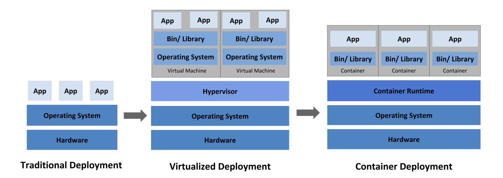
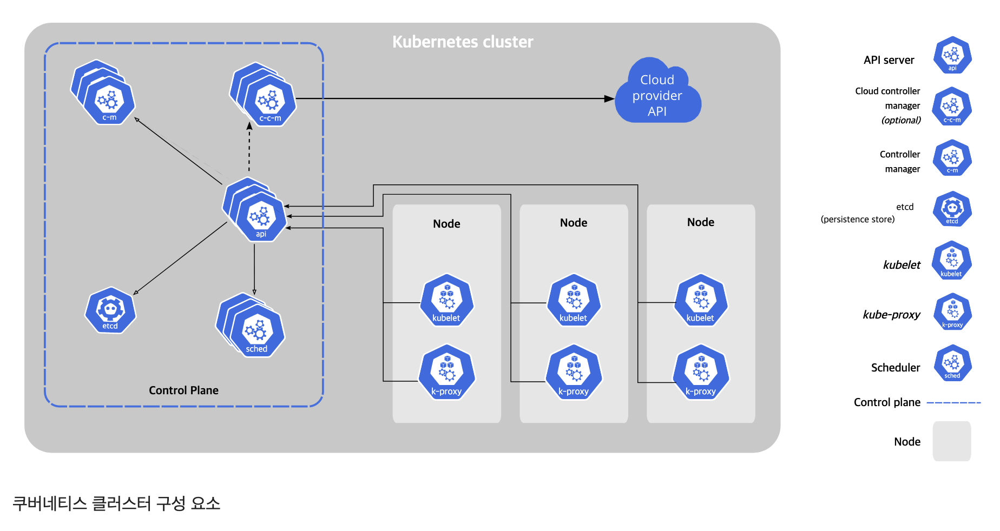

# 쿠버네티스 소개

- 쿠버네티스 등장 이유
    - 서버 배포를 자동으로 스케줄링하고 구성, 관리, 장애 처리를 포함하는 자동화를 위해 등장했ㄷ.
- 쿠버네티스 사용 이유
    - 애플리케이션 구성 요소 간 종속성의 차이 상관없이 일관된 환경 제공하며 (운영체제, 라이브러리, 시스템 구성, 네트워킹 환경, 기타 모든 환경) 동일 서버에 애플리케이션을 추가할 수 있다.
    - 하드웨어를 추상화하고 이를 애플리케이션 배포, 실행을 위한 플랫폼으로 제공하면서 개발자가 애플리케이션 구성, 배포할 수 있으며, 시스템 관리자는 애플리케이션이 아닌 인프라를 유지하고 운영하는데 집중할 수 있다.

## 1.2 컨테이너 기술 소개
쿠버네티스는 애플리케이션을 격리하는 기능을 제공하기 위해 리눅스 컨테이너 기술을 사용한다.

### 1.2.1 컨테이너 이해
- 리눅스 컨테이너 기술로 구성 요소 격리
    - 동일 호스트 시스템에서 여러 개 서비스 실행 가능하다.
    - 서로 다른 환경을 만들어주면서 가상머신과 유사하게 서로 격리하지만 오버헤드가 훨씩 적다.
    - 참고로, 컨테이너에서 실행되는 프로세스는 호스트 운영체제 내에서 실행된다(프로세스가 별도의 운영체제에서 실행되는 가상머신과 다름).
- 컨테이너와 가상머신 비교
   
   https://kubernetes.io/ko/docs/concepts/overview/what-is-kubernetes/
    - 가상머신과 다르게 호스트 OS 실행되는 하나의 격리된 프로세스로 애플리케이션이 소비하는 리소스만 소비하고 추가 프로세스의 오버헤드는 없다.
    - 가상머신의 오버헤드로 각 가상머신에 애플리케이션을 그룹으로 배포하는 경우가 종종 있다.
    - 컨테이너는 애플리케이션마다 하나의 컨테이너를 가질 수 있어, 동일 베어메탈 머신에서 더 많은 애플리케이션을 적재할 수 있다.
    - 가상머신
        - 물리적 하드웨어 리소스를 각 가상머신 내부의 운영체제에서 사용할 수 있는 더 작은 리소스로 나누는 호스트 OS와 하이퍼바이저가 있다. 
        - 해당 가상머신 내에서 실행되는 애플리케이션이 가상머신의 게스트 OS 커널에 대한 시스템 콜을 수행하면, 커널은 하이퍼바이저로 호스트의 물리적 CPU에서 x86 명령을 수행한다.
    - 컨테이너
        - 호스트 OS에서 실행되는 동일한 커널에서 시스템 콜을 수행한다. 이 커널은 호스트의 CPU에서 x86을 수행하는 유일한 커널이다.
        - 컨테이너는 가상머신처럼 부팅할 필요 없이, 시스템 서비스 실행하지 않고 즉시 시작된다.
        - 단점으로 컨테이너는 모두 동일한 커널을 호출함으로 보안 위험이 발생할 수 있다.
- 컨테이너 격리를 가능하게 하는 메커니즘 소개
    1. 리눅스 네임스페이스(namespace)로 각 프로세스가 시스템(파일, 프로세스, 네트워크 인터페이스, 호스트 이름 등)에 대한 독립된 뷰만 볼 수 있도록 한다.
    2. 리눅스 컨트롤 그룹(cgroups)으로 프로세스가 사용할 수 있는 리소스(CPU, 메모리, 네트워크 대역폭 등)의 양을 제한한다.
- 리눅스 네임스페이스로 프로세스 격리
    - 기본적으로 각 리눅스 시스템은 초기 구동 시 하나의 네임스페이스가 있다.
    - 파일시스템, 프로세스 ID, 사용자 ID, 네트워크 인터페이스 등과 같은 모든 시스템 리소스는 하나의 네임스페이스에 속하지만, 추가 네임스페이스를 생성하고 리소스를 구성할 수 있다.
    - 프로세스를 실행할 때 해당 네임스페이스 중 하나에서 프로세스를 실행한다. 프로세스는 동일한 네임스페이스 내에 있는 리소스만 볼 수 있다. 여러 종류의 네임스페이스가 있기 때문에 프로세스는 하나의 네임스페이스에만 속하는 것이 아니라 여러 네임스페이스에 속할 수 있다.
    - 네임스페이스의 종류
        - 마운트(mnt)
        - 프로세스 ID(pid)
        - 네트워크(net)
        - 프로세스 간 통신(ipc)
        - 호스트와 도메인 이름(uts)
        - 사용자 아이디(user)
    - 각 네임스페이스는 특정 리소스 그룹을 격리하는 데 사용된다.
        - 예로, 두 개의 서로 다른 UTS 네임스페이스를 한 쌍의 프로세스에 각각 지정하면 서로 다른 로컬 호스트 이름을 보게 할 수도 있다. 즉, 두 프로세스를 마치 두 개의 다른 시스템에서 실행 중인 것처럼 보이게 할 수 있다(적어도 호스트 이름에 관해서는 말이다)
        - 또한 프로세스가 속한 네트워크 네임스페이스는 실행 중인 애플리케이션의 프로세스에서 볼 수 있는 네트워크 인터페이스를 결정한다. 각 컨테이너는 고유한 네트워크 네임스페이스를 사용하므로 각 컨테이너는 고유한 네트워크 인터페이스 세트를 볼 수 있다.
    - 네임스페이스 관련 글 : (https://www.44bits.io/ko/keyword/linux-namespace](https://www.44bits.io/ko/keyword/linux-namespace)
- 프로세스의 가용 리소스 제한
    - 프로세스(또는 프로세스 그룹)의 리소스 사용을 제한하는 리눅스 커널 기능인 cgroups로 이뤄진다.
    - 프로세스는 설정된 양 이상의 CPU, 메모리, 네트워크 대역폭 등을 사용할 수 없다.

### 1.2.2 도커 컨테이너 플랫폼 소개
- 컨테이너 기술은 오래 사용되었지만, 도커는 컨테이너를 여러 시스템에 쉽게 이식 가능하게 하는 최초의 컨테이너 시스템이다.
- 애플리케이션뿐만 아니라 라이브러리, 여러 종속성, 심지어 전체 운영체제 파일시스템까지도 도커를 실행하는 다른 컴퓨터에 애플리케이션을 프로비저닝하는 데 사용할 수 있는 간편한 이식 가능한 패키지로 패키징하는 과정을 단순화했다.
- 도커 기반 컨테이너 이미지와 가상머신 이미지의 큰 차이점은 컨테이너 이미지가 여러 이미지에서 공유되고 재사용될 수 있는 레이어로 구성돼 있다는 것이다.

### 도커 개념 이해
- 도커는 애플리케이션을 패키징, 배포, 실행하기 위한 플랫폼이다.
- 애플리케이션에서 필요한 라이브러리나 운영체제의 파일시스템에 설치되는 모든 파일을 포함할 수 있다.
- 세 가지 주요 개념
    - 이미지 : 애플리케이션과  해당 환경을 패키지화한 것이다. 파일시스템과 이미지가 실행될 때 실행돼야 하는 실행파일 경로와 같은 메타데이터가 포함돼 있다.
    - 레지스트리 : 도커 이미지를 저장하고 다른 사람이나 컴퓨터 간에 해당 이미지를 쉽게 공유할 수 있는 저장소다.
    - 컨테이너 : 도커 기반 컨테이너 이미지에서 생성된 일반적인 리눅스 컨테이너다. 실행 중인 컨테이너는 도커를 실행하는 호스트에서 실행되는 프로세스지만, 호스트와 호스트에서 실행 중인 다른 프로세스와 완전히 격리됐다. 리소스 사용도 제한(cgroups)돼 할당된 리소스의 양(CPU, RAM 등)만 액세스하고 사용할 수 있다.

### 도커 이미지의 빌드, 배포, 실행
1. 개발자가 이미지를 만들기 위해 도커로 이미지를 빌드한다
2. 이미지 레지스트리로 푸시한다
3. 도커가 실행되는 컴퓨터에서 도커는 이미지를 가져온다
4. 이미지 기반으로 격리된 컨테이너를 만들고, 이미지의 일부로 지정된 바이너리 실행파일을 실행한다

### 이미지 레이어의 이해
- 모든 도커 이미지는 다른 이미지 위에 빌드되며 두 개의 다른 이미지는 기본 이미지로 동일한 부모 이미지를 사용할 수 있으므로 다른 이미지에는 정확히 동일한 레이어가 포함될 수 있다. (각 이미지 레이어는 각자의 해시값 ID를 가지고 있으며, 각 이미지 레이어는 부모 레이어의 해시값 ID를 가진다)
- 각 레이어는 동일 호스트에 한 번만 저장된다. (이를 통해 스토리지 공간을 줄일 수도 있다)
    - 컨테이너 이미지 레이어는 읽기 전용이다.
    - 컨테이너가 실행될 때 이미지 레이어 위에 새로운 쓰기 가능한 레이어가 만들어진다. 
    - 컨테이너의 프로세스가 기본 레이어 중 하나에 있는 파일에 쓰면 전체 파일의 복사본의 최상위 레이어에 만들어지고 프로세스는 복사본에 쓴다.
      (도커는 AUFS, OverlayFs 와 같은 union fileSystem 을 사용한다. 읽기 전용 레이어와 쓰기 레이어로 구성된다. 더 자세한건 위키의 Union_mount 참고.)
        

### 컨테이너 이미지의 제한적인 이식성 이해
- 호스트에서 실행되는 모든 컨테이너가 호스트의 리눅스 커널을 사용하는 것에 주의할 점이 있다.
- 컨테이너화된 애플리케이션이 특정 커널 버전이 필요하다면 모든 시스템에서 동작하지 않을 수 있다. (가상머신은 이런 제약이 없다)
- 커널뿐만 아니라 특정 하드웨어 아키텍처용으로 만들어진 컨테이너화된 애플리케이션은 해당 아키텍처 시스템에서만 실행될 수 있다는 점을 분명히 해야 한다. x86 아키텍처용으로 만들어진 애플리케이션을 ARM 기반 컴퓨터에서 도커가 실행된다고 해서 컨테이너화할 수 없다. 여전히 가상머신이 필요하다.
    

### 1.2.3 도커의 대안으로 rkt 소개
- 컨테이너의 격리는 리눅스 네임스페이스와 cgroup과 같은 커널 기능으로 리눅스 커널 수준에서 수행된다. 도커는 이런 기능들을 사용하기 쉽게 한다.
- 도커가 성공한 뒤 컨테이너 형식과 런타임에 관한 개방된 업계 표준을 만들려고 OCI(Open Container Initative)가 탄생했다. 도커도 또 다른 리눅스 컨테이너 엔진인 rkt와 마찬가지로 이 이니셔티브의 일부다.
- rkt도 컨테이너를 실행하기 위한 플랫폼이다. 보안, 결합성, 공개 표준 준수에 중점을 둔다. OCI 컨테이너 이미지 형식을 사용하며 일반 도커 컨테이너 이미지를 실행할 수도 있다. deprecated 됐다.

## 1.3 쿠버네티스 소개
### 1.3.1 쿠버네티스의 기원
수십만 대의 서버를 운영하는 구글.

### 1.3.2 넓은 시각으로 쿠버네티스 바라보기
- 쿠버네티스는 컨테이너화된 애플리케이션을 쉽게 배포하고 관리할 수 있게 해주는 소프트웨어 시스템이다.
- 쿠버네티스를 사용하면 모든 노드가 하나의 거대한 컴퓨터인 것처럼 수천 대의 컴퓨터 노드에서 소프트웨어 애플리케이션을 실행할 수 있다.

### 쿠버네티스 핵심 이해
- 시스템은 마스터 노드와 여러 워커 노드로 구성된다.
- 개발자가 애플리케이션 매니페스트를 마스터에 게시하면 쿠버네티스는 해당 애플리케이션을 동일한 워커 노드에 배포한다.

### 개발자가 애플리케이션 핵심 기능에 집중할 수 있도록 지원
- 쿠버네티스는 클러스터의 운영체제로 생각할 수 있다. 서비스 디스커버리, 스케일링, 로드밸런싱, 자가 치유, 리더 선출 같은 기능들이 있다.

### 운영 팀이 효과적으로 리소스를 활용할 수 있도록 지원
- 쿠버네티스는 클러스터 어딘가에 컨테이너화된 애플리케이션을 실행하고 구성 요소 간에 서로를 찾는 방법에 관한 정보를 제공하고 모든 애플리케이션을 계속 실행하게 한다.

### 1.3.3 쿠버네티스 클러스터 아키텍처 이해
두 가지 유형
- 마스터 노드 : 전체 쿠버네티스 시스템을 제어하고 관리하는 쿠버네티스 컨트롤 플레인을 실행한다.
- 워커 노드 : 실제 배포되는 컨테이너 애플리케이션을 실행한다.

https://kubernetes.io/ko/docs/concepts/overview/components/

### 컨트롤 플레인(Control Plane)
- 클러스터를 제어하고 작동시킨다.
- 하나의 마스터 노드에서 실행하거나 여러 노드로 분할되고 복제돼 고가용성을 보장할 수 있는 여러 구성 요소로 구성된다.
    구성 요소들
    - 쿠버네티스 API 서버 : 사용자, 컨트롤 플레인 구성 요소와 통신한다.
    - 스케줄러 : 애플리케이션의 배포를 담당한다 (애플리케이션의 배포 가능한 각 구성 요소를 워크 노드에 할당)
    - 컨트롤러 매니저 : 구성 요소 복제본, 워커 노드 추적, 노드 장애 처리 등과 같은 클러스터단의 기능을 수행한다.
    - Etcd : 클러스터 구성을 지속적으로 저장하는 신뢰할 수 있는 분산 데이터 저장소다.
- 컨트롤러 플레인의 구성 요소는 클러스터 상태를 유지하고 제어하지만 애플리케이션을 실행하진 않는다.

### 노드
- 워커 노드는 컨테이너화된 애플리케이션을 실행하는 시스템이다.
- 애플리케이션을 실행하고 모니터링하며 애플리케이션에 서비스를 제공하는 작업은 다음 구성 요소에 의해 수행된다.
    - 컨테이너를 실행하는 도커, rkt 또는 다른 컨테이너 런타임
    - API 서버와 통신하고 노드의 컨테이너를 관리하는 Kubelet
    - 애플리케이션 구성 요소 간에 네트워크 트래픽을 로드밸런싱하는 쿠버네티스 서비스 프록시(kube-proxy)

### 1.3.4 쿠버네티스에서 애플리케이션 실행
- 실행 방법
    1. 애플리케이션을 하나 이상의 컨테이너 이미지로 패키징
    2. 해당 이미지를 이미지 레지스트리로 푸시
    3. 쿠버네티스 API 서버에 애플리케이션 디스크립션 게시
        디스크립션에 포함된 정보는?
        - 컨테이너 이미지
        - 애플리케이션 구성 요소가 포함된 이미지
        - 해당 구성 요소가 서로 통신하는 방법
        - 동일 서버에 함께 배치돼야 하는 구성 요소
        - 실행할 각 구성 요소의 복제본 수
        - 내부 또는 외부 클라이언트에 서비스를 제공하는 구성 요소
        - 하나의 IP 주소로 노출해 다른 구성 요소에서 검색 가능하게 해야 하는 구성 요소 등등

### 디스크립션으로 컨테이너를 실행하는 방법 이해
- API 서버가 애플리케이션 디스크립션을 처리할 때 스케줄러는 각 컨테이너에 필요한 리소스를 계산하고 해당 시점에 각 노드에 할당되지 않은 리소스를 기반으로 각 파드의 지정된 복제본 수를 가능한 워커 노드로 할당한다.
- 그 다음 해당 노드의 Kubelet 은 컨테이너 런타임(Docker 등)에 필요한 컨테이너 이미지를 가져와 컨테이너를 실행하도록 지시한다.

### 실행된 컨테이너 유지
- 애플리케이션이 실행되면 쿠버네티스는 애플리케이션의 배포 상태가 사용자가 제공한 디스크립션과 일치하는지 지속적으로 확인한다.
- 워커 노드 전체가 종료되거나 액세스할 수 없게 되면 쿠버네티스는 이 노드에서 실행 중인 모든 컨테이너의 노드를 새로 스케줄링하고, 새로 선택한 노드에서 실행한다.

### 복제본 수 스케일링
- 애플리케이션이 실행되는 동안 복제본 수를 늘릴지 줄일지 결정할 수 있으며, 쿠버네티스는 추가 복제본을 기동하거나 초과 복제본을 정지시킬 것이다.
- 쿠버네트스에 맡길 수도 있다. CPU 부하, 메모리 사용량, 초당 요청 수, 애플리케이션이 노출하는 다른 메트릭과 같은 실시간 메트릭을 기반으로 복제본 수를 자동으로 조정할 수 있다.

### 이동한 애플리케이션에 접근하기
- 쿠버네티스는 컨테이너를 클러스터 안에서 이동시킬 수도 있다.
- 클라이언트가 특정 서비스를 제공하는 컨테이너를 쉽게 찾을 수 있도록 쿠버네티스에게 동일한 서비스를 제공하는 컨테이너를 알려주면 쿠버네티스는 하나의 고정 IP 주소로 모든 컨테이너를 노출하고 해당 주소를 클러스터에서 실행 중인 모든 애플리케이션에 노출한다.
- 이는 환경변수로 제공되지만 클라이언트는 오래전부터 사용된 DNS로 서비스 IP를 조회할 수 있다.
- kube-proxy는 서비스를 제공하는 모든 컨테이너에서 서비스 연결이 로드밸런싱되도록 한다. 서비스의 IP 주소는 일정하게 유지(컨테이너는 다른 노드로 옮겨져 재시작하면 새 IP를 받지만, 서비스는 여전히 동일한 IP를 가진다)되므로 클라이언트는 컨테이너가 클러스터 내에서 이동하더라도 컨테이너에 항상 연결할 수 있다.

### 1.3.5 쿠버네티스 사용의 장점
- 쿠버네티스를 설치한 경우 컨테이너화된 애플리케이션은 이미 실행에 필요한 모든 것이 포함돼 있으므로 시스템 관리자는 애플리케이션을 배포하고 실행하기 위해 아무것도 설치할 필요가 없고, 즉시 애플리케이션을 실행할 수 있다.
- 애플리케이션 배포의 단순화
    - 쿠버네티스는 모든 워커 노드를 하나의 배포 플랫폼으로 제공하기 때문에 개발자가 자체적으로 애플리케이션 배포를 시작할 수 있으며 클러스터를 구성하는 서버에 관해 알 필요가 없다.
    - 서버(노드)는 애플리케이션에 적절한 시스템 리소스를 제공할 수 있는 한 애플리케이션이 어느 서버에서 실행 중인지 신경 쓰지 않는다.
- 하드웨어 활용도 높이기
    - 쿠버네티스에 애플리케이션을 실행하도록 지시하면 애플리케이션의 리소스 요구 사항에 대한 디스크립션과 각 노드에서 사용 가능한 리소스에 따라 애플리케이션을 실행할 가장 적합한 노드를 선택할 수 있다.
    - 특정 노드를 지정하지 않는 한 쿠버네티스는 언제든 클러스터 간에 애플리케이션이 이동할 수 있으므로, 수동으로 수행하는 것보다 훨씬 더 인프라를 잘 활용할 수 있다.
- 상태 확인과 자가 치유
    - 쿠버네티스는 애플리케이션 구성 요소와 이 애플리케이션이 구동 중인 노드를 모니터링하다가 노드 장애 발생 시 자동으로 애플리케이션을 다른 노드로 스케줄링한다.
    - 운영팀은 수동으로 마이그레이션할 필요가 없어지고, 애플리케이션을 재배치하는 대신 즉시 노드 자체를 수정해 사용 가능한 하드웨어 리소스 풀에 반환하는 데 집중할 수 있다.
    - 인프라에 장애가 발생한 노드가 없어도 정상적인 시스템 작동이 가능하도록 충분한 예비 자원이 있는 경우 즉시 대응할 필요가 없다.
- 오토스케일링
    - 쿠버네티스를 사용하면 애플리케이션의 부하를 지속 모니터링할 필요가 없어진다.
    - 클라이두 인프라에서 쿠버네티스가 실행 중인 경우 클라우드 제공업체의 API로 쉽게 노드를 추가하면 배포된 애플리케이션의 부하에 따라 전체 클러스터 크기를 자동으로 확장하거나 축소할 수 있다. (책 출간 시 프리뷰였는데 지금은?)
- 애플리케이션 개발 단순화
    1. 개발과 프로덕션 환경이 모두 동일한 환경에서 실행된다. 버그 찾기 좋다.
    2. 개발자가 구현해야 하는 클러스터된 애플리케이션에서 서비스나 피어(peer)검색하는 기능을 쿠버네티스가 제공한다. 일반적으로 애플리케이션은 특정 환경변수만 조회하거나 DNS 조회만 수행하면 된다. 충분하지 않다면 애플리케이션에서 쿠버네티스 API 서버를 직접 쿼리해 해당 정보나 혹은 다른 정보를 얻을 수 있다. 쿠버네티스 API 서버를 쿼리하면 개발자가 리더 선정 같은 복잡한 메커니즘을 구현하지 않아도 된다.
    3. 새로운 버전의 애플리케이션을 출시할 때 쿠버네티스가 새로운 버전이 잘못됐는지 자동으로 감지하고 즉시 롤아웃을 중지한다. 지속적인 전달(continuous delivery)를 가속화해 조직 전체에 도움이 된다.
    
## 1.4 정리
- 모놀리스 애플리케이션은 구축하기 쉽지만 시간이 지남에 따라 유지 관리하기가 더 어려워지고 때로는 확장이 불가능할 수 있다.
- 마이크로서비스 기반 애플리케이션 아키텍처는 각 구성 요소의 개발을 용이하게하지만 하나의 시스템으로 동작하도록 배포하고 구성하기가 어렵다.
- 리눅스 컨테이너는 가상머신과 동일한 이점을 제공하지만 훨씬 더 가볍고 하드웨어 활용도를 높일 수 있다.
- 도커는 OS 환경과 함께 컨테이너화된 애플리케이션을 좀 더 쉽고 빠르게 프로비저닝할 수 있도록 지원해 기존 리눅스 컨테이너 기술을 개선했다.
- 쿠버네티스는 전체 데이터 센터를 애플리케이션 실행을 위한 컴퓨팅 리소스로 제공한다.
- 개발자는 시스템 관리자의 도움 없이도 쿠버네티스로 애플리케이션을 배포할 수 있다.
- 시스템 관리자는 쿠버네티스가 고장 난 노드를 자동으로 처리하도록 함으로써 더 편하게 잠을 잘 수 있다.
