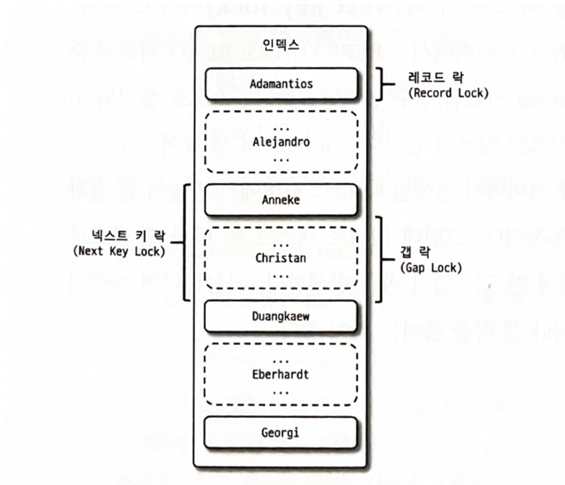
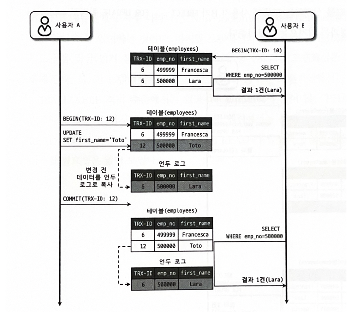

### 잠금 VS 트랜잭션
- 잠금 : 동시성 제어를 위한 기능. 잠금은 한 시점에 하나의 커넥션만 변경할 수 있게 해준다.
- 트랜잭션 : 데이터 정합성 보장을 위한 기능. 트랜잭션을 지원하지 않을 경우 부분 업데이트(Partial Update)가 발생할 수 있다. 

### MySQL 트랜잭션
- MyISAM 스토리지 엔진은 트랜잭션을 지원하지 않지만, InnoDB 스토리지 엔진은 트랜잭션을 지원한다.
- 트랜잭션은 최소 범위에 적용하는 것이 좋다. 데이터베이스 커넥션은 개수가 제한적이기 때문이다.

### 잠금
- MySQL의 락은 **MySQL 엔진**과 **스토리지 엔진** 두 가지로 나눌 수 있다.
- MySQL 엔진 레벨의 락은 모든 스토리지 엔진에 영향을 미친다. 
- 스토리지 엔진 레벨의 락은 스토리지 엔진 간의 영향을 미치지 않는다.

### MySQL 엔진의 잠금
- 글로벌 락
    - MySQL 에서 제공하는 락 중 범위가 가장 크다.
      - FLUSH TABLE WITH READ LOCK 명령으로 획득
    - 한 세션에서 글로벌 락을 획득하면, 다른 세션에서 SELECT 를 제외한 대부분의 DDL/DML 실행시 해당 락이 해제될 때까지 대기해야 한다.
    - 8.0 부터는 InnoDB 가 기본 스토리지 엔진으로 채택 되며 Xtrabackup/Enterprise Backup 과 같은 툴들을 위한 백업락이 도입되었다
- 테이블 락
    - 테이블 단위로 설정된다. 
    - 명시적/묵시적으로 획득 가능하다. 특별한 상황이 아니면 거의 사용하지 않는다.
    - MyISAM, MEMORY 테이블에서 데이터를 변경하면 묵시적으로 발생한다.
    - InnoDB 테이블의 경우 레코드 기반 잠금을 지원하기 때문에 단순 데이터 변경으로 묵시적 락은 발생하지 않는다. 
      - 스키마 변경(DDL) 시 발생한다.
- 네임드 락
    - GET_LOCK() 함수로 **임의의 문자열**에 대한 락 설정이 가능하다. 자주 사용되지 않는다.
    - 분산락으로 사용한 케이스 : https://techblog.woowahan.com/2631/
- 메타데이터 락
    - 데이터베이스 객체(테이블/뷰)의 이름/구조 변경 시 획득하는 락 

### InnoDB 스토리지 엔진 잠금
  - InnoDB 스토리지 엔진은 레코드 기반 락을 제공해서 MyISAM 보다 뛰어난 동시성 처리를 제공한다.
  - 버전 별 락에 대한 정보 조회하는 방법
    - 5.1 
      - information_schema.INNODB_TRX
      - information_schema.INNODB_LOCKS
      - information_schema.INNODB_LOCK_WAITS
    - 8.0
      - performance_schema.data_locks
      - performance_schema.data_lock_waits
  - KILL 명령어를 통해 락을 종료할 수 있다. 
  - Performance Schema 로 내부 잠금에 대해 모니터링도 할 수 있다.
(https://velog.io/@99mon/Real-MySQL-8.0-CH-05.-트랜잭션)
  - 레코드 락
    - 레코드 자체만을 잠근다. 
    - 인덱스의 레코드에 대해 동작한다. 인덱스가 없는 테이블은 내부적으로 자동 생성된 클러스터 인덱스를 이용해 잠금을 설정한다.
    - PK 또는 유니크 인덱스에 대한 변경 작업에서는 레코드 락을 사용한다.
    - 보조 인덱스를 이용한 변경 작업은 갭 락과 넥스트 키 락을 건다.
  - 갭 락
    - 레코드와 바로 인접한 레코드 사이의 간격을 잠그는 것을 갭 락이라고 한다. 
    - 레코드와 레코드 사이에 새로운 레코드가 생성되는 것을 막는다. 넥스트 키 락의 일부로 자주 사용된다.
  - 넥스트 키 락
    - 레코드 락 + 갭 락
      - 바이너리 로그에 기록되는 쿼리가 레플리카에 복제될 때 동일한 결과를 만들도록 보장하는 것이 목적이다.
    - 넥스트 키 락/갭 락으로 데드락이나 성능저하가 빈번하다.
  - 자동 증가 락
    - AUTO_INCREMENT 칼럼이 사용된 테이블에 대해 순서를 보장하기 위해 사용된다. 
      - 테이블 레벨의 락이다.
    - 트랜잭션과 관계없이 AUTO_INCREMENT 값을 가져오는 순간에만 락이 걸렸다 해제된다.
    - MySQL 5.1 이상부터는 innodb_autoinc_lock_mode 시스템 변수를 이용해 자동 증가 락의 작동 방식 변경이 가능하다.
      - innodb_autoinc_lock_mode=0
        - MySQL 5.0 과 동일한 잠금 방식으로 모든 INSERT 문장은 자동 증가 락을 사용한다.
      - innodb_autoinc_lock_mode=1
        - INSERT 되는 레코드의 건수를 정확히 캐치할 수 있을 때는 자동 증가 락을 사용하지 않고, 훨씬 가볍고 빠른 래치(뮤텍스)를 사용한다.
        - 캐치할 수 없다면 5.0과 동일한 락을 사용한다. 
      - innodb_autoinc_lock_mode=2
        - 항상 래치(뮤텍스)를 사용한다.

- 인덱스와 잠금
    - InnoDB 락은 인덱스를 잠그는 방식이다. 
    - 변경할 레코드를 찾기 위해 검색한 인덱스의 레코드에 모두 락을 걸어야 한다. 
    - UPDATE 조건에 인덱스가 있다면 그 인덱스에 해당하는 로우 모두가 락에 걸리고, 인덱스가 없으면 테이블 풀 스캔으로 모든 데이터가 락이 걸린다.

- 레코드 레벨 잠금 확인 및 해제
  - InnoDB 엔진을 사용하는 테이블의 레코드 레벨 락은 테이블 레벨 락 보다 복잡함 
  - 레코드 레벨의 락은 테이블의 레코드 각각에 잡혀 오랫동인 락이 걸려있어도 발견되지 않는 경우도 존재함
  - 버전 별 락에 대한 정보 조회하는 방법
    - 5.1
        - information_schema.INNODB_TRX
        - information_schema.INNODB_LOCKS
        - information_schema.INNODB_LOCK_WAITS
    - 8.0
      - performance_schema.data_locks
      - performance_schema.data_lock_waits
      - `SELECT * FROM performance_schema.data_locks
        ORDER BY ENGINE_TRANSACTION_ID, THREAD_ID`  

### MySQL 격리 수준
트랜잭션의 격리 수준은 여러 트랜잭션이 동시에 처리될 때, 특정 트랜잭션이 다른 트랜잭션에서 변경하거나 조회하는 데이터를 볼 수 있게 허용할지 말지를 결정하는 것이다.

- READ UNCOMMITED
  - 각 트랜잭션의 변경 내용을 COMMIT/ROLLBACK 여부와 관계 없이 다른 트랜잭션에서 볼 수 있다.
  - DIRTY READ 가 발생하며, 거의 사용하지 않는 격리 레벨이다.
- READ COMMITED
  - 오라클 DBMS에서 기본으로 사용되는 격리 수준이다.
  - COMMIT 이 완료된 데이터만 다른 트랜잭션에서 조회가 가능하다.
  - 다른 트랜잭션에서 SELECT 조회 시 실제 데이터가 아닌, 언두영역에 존재하는 데이터를 읽어온다.
  - 조회할 때마다 커밋된 다른 데이터가 조회될 수 있다.
- REPEATABLE READ
  - (https://velog.io/@99mon/Real-MySQL-8.0-CH-05.-트랜잭션)
  - MySQL InnoDB 엔진에서 기본으로 사용되는 격리 수준이다.
  - 변경되기 전 레코드를 언두 공간에 백업해두고 실제 레코드 값을 변경하는데, 이를 MVCC(Multi Version Concurrency Control)이라 한다. 
  - REPEATABLE READ 와 READ COMMITTED 의 차이는 언두 영역에 백업된 레코드의 여러 버전 가운데 몇 번째 이전 버전까지 찾아 들어가야 하느냐에 있다.
  - 모든 트랜잭션은 고유한 트랜잭션 번호를 가지며, 언두 영역의 모든 백업 레코드는 트랜잭션의 번호를 포함한다. 
    - REPEATABLE READ 에서는, 실행 중인 트랜잭션 번호보다 앞선 언두 영역의 데이터는 삭제할 수 없다.
  - InnoDB 스토리지 엔진에서 REPEATABLE READ 는 갭락과 넥스트 키 락 덕분에 일반적인 상황에서는 팬텀 리드가 발생하지 않는다.
    - SELECT ~ FOR UPDATE 쿼리는 SELECT 하는 레코드에 쓰기 잠금을 걸어야 하는데, 언두 레코드에는 잠금을 걸 수 없어 현재 레코드의 값을 가져와야만 한다. 
      - 그러면 조회할 때마다 값이 보였다 안보였다 할 수 있는데, 이런 현상을 PHANTOM READ(PHANTOM ROW)라고 한다.
    - SELECT FOR UPDATE, LOCK IN SHARE MODE, UPDATE, DELETE 등이 해당된다.
- SERIALIZABLE
    - 가장 단순하면서 가장 엄격한 격리 수준이다.
    - 읽기 작업 또한 읽기 잠금을 획득 해서 처리한다.