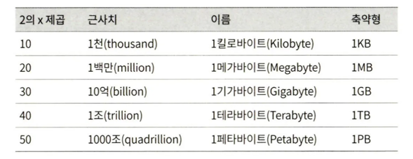
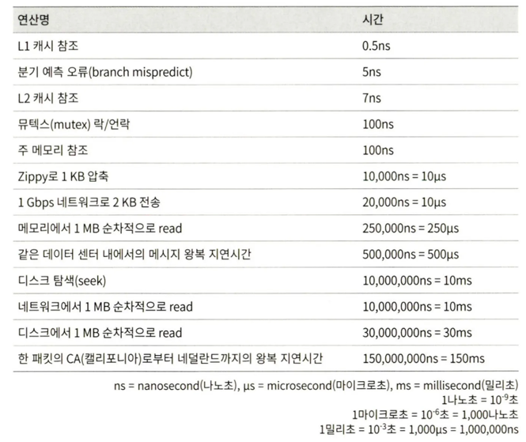
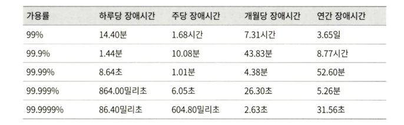

개략적 규모 추정을 효과적으로 하려면 규모 확장성을 표현하는 데 필요한 기본기에 능숙해야 한다.

- 2의 제곱수
- 응답지연 값
- 가용성 관련 수치

## 2의 제곱수

최소 단위는 1바이트이고, 8비트로 구성된다. ASCII 문자 하나가 차지하는 메모리 크기가 1바이트다.

## 모든 프로그래머가 알아야 하는 응답지연 값

- 메모리는 빠르지만 디스크는 아직도 느리다.
- 디스크 탐색(seek)은 가능한 한 피하라.
- 단순한 압축 알고리즘은 빠르다.
- 데이터를 인터넷으로 전송하기 전에 가능하면 압축하라.
- 데이터 센터는 보통 여러 지역에 분산되어 있고, 센터들 간에 데이터를 주고받는 데는 시간이 걸린다.

## 가용성에 관계된 수치들

- 고가용성(high availability)은 시스템이 오랜 시간 동안 지속적으로 중단 없이 운영될 수 있는 능력을 지칭하는 용어다. 고가용성을 표현하는 값은 퍼센트로 표현하는데, 100% 는 시스템이 단 한 번도 중단된 적이 없었음을 의미한다. 대부분 서비스는 99%에서 100% 사이의 값을 갖는다.
- SLA(Service Level Agreement)는 서비스 사업자(service provider)가 보편적으로 사용하는 용어로, 서비스 사업자와 고객 사이에 맺어진 합의를 의미한다. 이 합의에는 서비스 사업자가 제공하는 가용시간(uptime)이 공식적으로 기술되어 있다. 아마존, 구글, 마이크로소프트 같은 사업자는 99% 이상의 SLA를 제공한다. 가용시간은 관습적으로 숫자 9를 사용해 표시한다. 9가 많으면 많을수록 좋다.
- 9의 개수와 시스템 장애 시간(downtime) 사이의 관계다.

## 예제: 트위터 QPS와 저장소 요구량 추정

연습용이며 트위터 실제 성능, 요구사항과는 관련 없다.

### 가정

- 월간 능동 사용자(monthly active user)는 3억명이다.
- 50%의 사용자가 트위터를 매일 사용한다.
- 평균적으로 각 사용자는 매일 2건의 트윗을 올린다.
- 미디어를 포함하는 트윗은 10% 정도다.
- 데이터는 5년간 보관된다.

### 추정

QPS(Query Per Second) 추정치

- 일간 능동 사용자(Daily Active User, DAU) = 3억 * 50% = 1.5억
- QPS = 1.5억 * 2 트윗 / 24시간 / 3600초 = 약 3500
- 최대 QPS(Peek QPS) = 2 * QPS = 약 7000

미디어 저장을 위한 저장소 요구량

- 평균 트윗 크기
    - tweet_id에 64바이트
    - 텍스트에 140바이트
    - 미디어에 1MB
- 미디어 저장소 요구량 : 1.5억 * 2 * 10% * 1MB = 30TB / 일
- 5년간 미디어를 보관하기 위한 저장소 요구량 : 30TB * 365 * 5 = 약 55PB

## 팁

개략적인 규모 추정과 관계된 면접에서 가장 중요한 것은 문제를 풀어나가는 절차다. 결과보다 중요하다. 면접자는 문제 해결 능력을 보고 싶어한다.

### 몇 가지 팁

- 근사치를 활용한 계산(rounding and approximation) : 예로 “99987/9.1”의 계산 결과를 알기 어렵다. 근사치를 활용하자. “100,000/10” 로 간소화할 수 있다.
- 가정(assumption)들은 적어 두라. 나중에 살펴볼 수 있도록.
- 단위(unit)을 붙이라. 5가 아닌 5KB, 5MB인지.
- 많이 출제되는 개략적 규모 추정 문제는 QPS, 최대 QPA, 저장소 요규량, 캐시 요구량, 서버 수 등을 추정하는 것이다. 면접 전 계산하는 연습을 미리 하자.