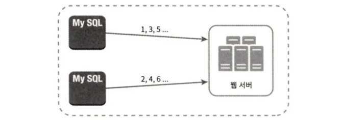
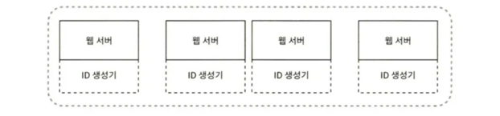
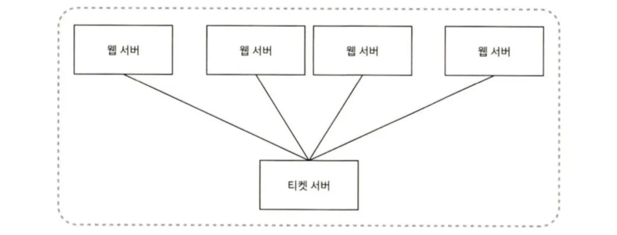
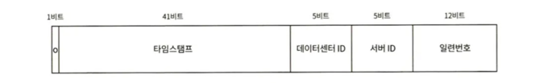

auto_increment 속성이 설정된 관계형 데이터베이스의 기본 키는 분산 환경에서 쓰기 어렵다.

## 1단계 문제 이해 및 설계 범위 확정

- ID는 유일해야 한다.
- ID는 숫자로만 구성되어야 한다.
- ID는 64비트로 표현될 수 있는 값이어야 한다.
- ID는 발급 날짜에 따라 정렬 가능해야 한다.
- 초당 10,000개의 ID를 만들 수 있어야 한다.

## 2단계 개략적 설계안 제시 및 동의 구하기

분산 시스템에서 유일성이 보장되는 ID를 만드는 방법은 여러 가지다.

- 다중 마스터 복제 (multi-master replication)
- UUID(Universally Unique Identifier)
- 티켓 서버(ticket server)
- 트위터 스노플레이크(twitter snowflake) 접근법

### 다중 마스터 복제

- 데이터베이스의 auto_increment 기능을 활용한다. 
- 다음 ID의 값을 구할 때 1이 아닌 k만큼 증가시킨다. (k = 현재 사용 중인 데이터베이스 서버의 수) 
- 데이터베이스 수를 늘리면 초당 생산 가능 ID 수도 늘릴 수 있어 규모 확장성 문제를 어느 정도 해결할 수 있다.

- 단점
  - 여러 데이터 센터에 걸쳐 규모를 늘리기 어렵다.
  - ID의 유일성은 보장되겠지만 시간 흐름에 맞추어 커지도록 보장할 수는 없다.
  - 서버를 추가하거나 삭제할 때도 잘 동작하도록 만들기 어렵다.

### UUID

- UUID는 컴퓨터 시스템에 저장되는 정보를 유일하게 식별하기 위한 128비트짜리 수다. 
- UUID 값은 충돌 가능성이 지극히 낮다. 위키디피아를 인용하면 “중복 UUID가 1개 생길 확률을 50%로 끌어 올리려면 초당 10억 개의 UUID를 100년 동안 계속해서 만들어야 한다.” 
- UUID 값은 09c93e62-50b4-468d-bf8a-c07e1040bfb2와 같은 형태를 띤다. 
- UUID는 서버 간 조율없이 독립적으로 생성 가능하다.

장점

- UUID를 만드는 것은 단순하다. 서버 사이의 조율이 필요 없으므로 동기화 이슈도 없다.
- 각 서버가 자기가 쓸 ID를 알아서 만드는 구조이므로 규모 확장도 쉽다.

단점

- ID가 128비트로 길다. 이번 장의 요구사항은 64비트다.
- ID를 시간순으로 정렬할 수 없다.
- ID에 숫자 아닌 값이 포함될 수 있다.

### 티켓 서버

- 플리커는 분산 기본 키를 만들어 내기 위해 이 기술을 사용하였다.
- auto_increment 기능을 갖춘 데이터베이스 서버(티켓 서버)를 중앙 집중형으로 하나만 사용하는 것이다.

장점

- 유일성이 보장되는 오직 숫자로만 구성된 ID를 쉽게 만들 수 있다.
- 구현하기 쉽고, 중소 규모 애플리케이션에 적합하다.

단점

- 티켓 서버가 SPOF(Single-Point-of-Failure)가 된다. 
  - 티켓 서버에 장애가 발생하면, 해당 서버를 이용하는 모든 시스템이 영향을 받는다. 
  - 이 이슈를 피하려면 티켓 서버를 여러 대 준비해야 하는데 데이터 동기화 문제가 발생할 것이다.

### 트위터 스노플레이크 접근법

- 각개격파 전략을 적용한다. 
- 생성해야 하는 ID의 구조를 여러 절로 분할하는 것이다. 
- 64비트 ID의 구조다.

- 사인(sign) 비트 : 1비트. 음수와 양수를 구별하는 데 사용한다.
- 타임스탬프(timestamp) : 41비트. 기원 시각(epoch) 이후로 몇 밀리초가 경과했는지를 나타내는 값이다.
- 데이터센터 ID : 5비트. 2^5=32개의 데이터센터를 지원할 수 있다.
- 서버 ID : 5비트. 데이터센터당 32개 서버를 사용할 수 있다.
- 일련번호 : 12비트. 각 서버에서 ID를 생성할 때마다 이 일련번호를 1만큼 증가시킨다. 이 값은 1밀리초가 경과할 때마다 0으로 초기화된다.

## 3단계 상세 설계 (트위터 스노플레이크 접근법 상세 설계)

- 데이터센터 ID와 서버 ID는 시스템이 시작할 때 결정되며, 일반적으로 시스템 운영 중에는 바뀌지 않는다. 
- 데이터센터 ID나 서버 ID를 잘못 변경하게 되면 ID 충돌이 발생할 수 있어 작업 시 신중해야 한다. 

### 타임스탬프

- 타임스탬프는 시간의 흐름에 따라 큰 값을 갖게 되어, ID는 시간순으로 정렬 가능하다.
- 수를 십진수로 변환 → 트위터 기원 시각(epoch)을 더함 → 결과로 얻어진 밀리초 값을 UTC 시각으로 변환
- 이 ID 생성기는 69년동안만 정상 동작하고, 69년이 지나면 기원 시각을 바꾸거나 ID 체계를 다른 것으로 마이그레이션해야 한다.

### 일련번호

- 12비트므로, 2^12 = 4096 개의 값을 가질 수 있다. 
- 밀리초 동안 하나 이상의 ID를 만들어 낸 경우에만 0보다 큰 값을 갖게 된다.

# 4단계 마무리

- 스노플레이크는 모든 요구사항을 만족하면서도 분산 환경에서 규모 확장이 가능하다.

- 설계를 진행하고 시간이 남았다면 논의할 수 있는 부분

  - 시계 동기화(clock synchronization)  
    - ID 생성 서버들이 전부 같은 시계를 사용한다고 가정했지만, 하나의 서버가 여러 코어에서 실행될 경우 유효하지 않을 수 있다. 
    - NTP(Network Time Protocol)은 이 문제를 해결하는 가장 보편적 수단이다.

  - 각 절(section)의 길이 최적화
    - 예를 들어 동시성이 낮고 수명이 긴 애플리케이션이라면 일련번호 절의 길이를 줄이고 타임스탬프 절의 길이를 늘리는 것이 효과적일 수도 있을 것이다.
  - 
  - 고가용성 
    - ID 생성기는 아주 높은 가용성을 제공해야 한다.