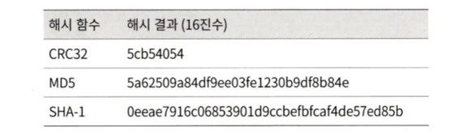

## 1단계 문제 이해 및 설계 범위 확정

- URL 단축 : 주어진 긴 URL을 훨씬 짧게 줄인다.
- URL 리디렉션 : 축약된 URL로 HTTP 요청이 오면 원래 URL로 안내
- 높은 가용성과 규모 확장성, 장애 감내

### 개략적 추정

- 쓰기 연산 : 매일 1억 개의 단축 URL 생성
- 초당 쓰기 연산 : 1억(100million)/24/3600 = 1160
- 읽기 연산 : 읽기와 쓰기 연산 비율이 10:1 이라면, 읽기 연산은 초당 11,600회 (1160 * 10 = 11,600).
- 10년간 운영한다고 가정하면 1억(100million) * 365 * 10 = 3650억 개의 레코드를 보관해야 한다.
- 축약 전 URL의 평균 길이는 100byte라고 할 때, 10년 동안 필요한 저장 용량은 3650억 * 100바이트 = 36.5TB이다.

## 2단계 개략적 설계안 제시 및 동의 구하기

### API 엔드포인트

URL 단축기는 기본적으로 두 개의 엔드포인트를 필요로 한다.

1. URL 단축용 엔드포인트 : 단축할 URL을 인자로 실어서 POST 요청을 보낸다.
2. URL 리디렉션용 엔드포인트 : 단축 URL에 대해서 HTTP 요청이 오면 원래 URL로 보내주기 위한 용도의 엔드포인트.

### URL 리디렉션

브라우저에 단축 URL을 입력하면, 단축 URl을 받은 서버는 그 URL을 원래 URL로 바꾸어서 301 응답의 Location 헤더에 넣어 반환한다.

- 301 Permanently Moved
  - 해당 URL에 대한 HTTP 요청의 처리 책임이 영구적으로 Location 헤더에 반환된 URL로 이전되었다는 응답이다. 
  - 영구적으로 이전되어 브라우저는 이 응답을 캐시(cache)한다. 
  - 추후 같은 URL에 요청을 보낼 때 브라우저는 캐시된 원래 URL로 요청을 보내게 된다.
- 302 Found
  - 요청이 ‘일시적으로’ Location 헤더가 지정하는 URL에 의해 처리되어야 한다는 응답이다. 
  - 클라이언트의 요청은 언제나 단축 URL 서버에 먼저 보내진 후에 원래 URL로 리디렉션 된다.

두 방법은 각각 장단점이 있다.

- 서버 부하를 줄이는 것이 중요하다면 301 Permanent Moved를 사용하여 첫 번째 요청만 단축 URL 서버로 전송되게 할 수 있다.
-트래픽 분석이 중요할 때는 302 Found를 쓰는 것이 클릭 발생률이나 발생 위치를 추적하는 데 좀 더 유리할 것이다.

URL 리디렉션을 구현하는 가장 직관적인 방법은 해시 테이블을 사용하는 것이다. 
- 해시 테이블에 <단축 URL, 원래 URL>의 쌍을 저장

### URL 단축

긴 URL을 해시 값으로 대응시킬 해시 함수 fx를 찾는 것은 중요하다.

- 입력으로 주어지는 긴 URL이 다른 값이면 해시 값도 달라야 한다.
- 계산된 해시 값은 원래 입력으로 주어졌던 긴 URL로 복원될 수 있어야 한다.

## 3단계 상세 설계

### 데이터 모델

모든 것을 해시 테이블에 둘 경우 메모리는 유한한 데다 비싸다. 관계형 데이터베이스에 저장한다.

- 예를 들어 id, shortURL, longURL의 세 개 칼럼을 갖는다.

### 해시 함수

해시 함수(hash function)은 원래 URL을 단축 URL로 변환하는 데 쓰인다. 

**해시 값 길이**

- hashValue(해시 함수가 계산한 단축 URL 값)는 [0-9, a-z, A-Z]의 문자들로 구성된다. 
- 사용할 수 있는 문자의 개수는 10+26+26=62개이다.
- 3650억 개의 URL을 만들어 낼 수 있어야 한다. n=7 이면 3.5조개의 URL을 만들 수 있다. 
- 요구사항을 만족시킬 수 있어 hashValue의 길이는 7로 한다.

### 해시 후 충돌 해소

해시 함수 구현에 쓰일 기술로 두 가지가 있는데 ‘해시 후 충돌 해소’ 방법, ‘base-62 변환’ 법이 있다.

쉬운 방법은 CRC32, MD5, SHA-1 같이 잘 알려진 해시 함수를 이용하는 것이다.

CRC32가 계산한 가장 짧은 해시값조차도 7보다는 길다.

처음 7개 글자만 이용하더라도 해시 결과가 서로 충돌할 확률이 높아진다.
- 충돌이 발생했을 때는, 충돌이 해소될 때까지 사전에 정한 문자열을 해시값에 덧붙일 수 있다.
- 충돌은 해소할 수 있지만 한 번 이상 데이터베이스 질의를 해야 하므로 오버헤드가 크다. 데이터베이스 대신 블룸 필터를 사용하면 성능을 높일 수 있다. 
- **블룸 필터**는 어떤 집합에 특정 원소가 있는지 검사할 수 있도록 하는 확률론에 기초한 공간 효율이 좋다.[2]

### base-62 변환

흔히 사용되는 접근법 중 하나다. 수의 표현 방식이 다른 두 시스템이 같은 수를 공유해야할 때 유용하다. 62진법을 쓰는 이유는 사용할 수 있는 문자 개수가 62개이기 때문이다.

- 유일성 보장 ID 생성기가 필요하다.
- ID가 1씩 증가해 다음 단축 URL이 예측되는 보안적 문제가 발생할 수 있고, 유일성 보장 ID가 길어짐과 비례해서 단축 URL 길이가 길어진다.

## URL 단축기 상세 설계 (62진법 변환 기법 사용)

1. 입력으로 긴 URL을 받는다.
2. 데이터베이스에 해당 URL이 있는지 검사한다.
3. 데이터베이스에 있다면 해당 URL에 단축 URL을 가져와서 클라이언트에게 반환한다.
4. 데이터베이스에 없다면 **유일한 ID**를 생성한다(7장 참고). 데이터베이스의 기본 키로 사용된다.
5. 62진법 변환을 적용, ID를 단축 URL로 만든다.
6. ID, 단축 URL, 원래 URL로 새 데이터베이스 레코드를 만든 후 단축 URL을 클라이언트에 전달한다.

### URL 리디렉션 상세 설계

쓰기보다 읽기를 더 자주 하는 시스템이라, <단축 URL, 원래 URL>의 쌍을 캐시에 저장하여 성능을 높인다.

1. 사용자가 단축 URL을 클릭한다.
2. 로드밸런서가 해당 클릭으로 발생한 요청을 웹 서버에 전달한다.
3. 이미 캐시에 있는 경우에는 원래 URL을 꺼내서 클라이언트에게 전달한다.
4. 캐시에 해당 단축 URL이 없는 경우에 데이터베이스에서 꺼낸다.
5. 데이터베이스에서 꺼낸 URL을 캐시에 넣은 후 사용자에게 반환한다.

## 4단계 마무리

설계를 진행하고 시간이 남았다면 논의할 수 있는 부분

- 처리율 제한 장치(rate limiter)
  - IP 주소를 비롯한 필터링 규칙들을 이용해 엄청난 요청을 걸러낼 수 있다. (4장)
- 웹 서버의 규모 확장
  - 본 설계에 포함된 웹 계층은 무상태(stateless) 계층이므로, 웹 서버를 증설하거나 삭제할 수 있다.
- 데이터베이스의 규모 확장
  - 데이터베이스를 다중화하거나 샤딩(sharding)하여 규모 확장성을 달성한다.
- 데이터 분석 솔루션(analytics)
  - URL 단축기에 데이터 분석 솔루션을 통합해 어떤 링크를 얼마나 많은 사용자가 클릭했는지, 언제 주로 클릭했는지 등 중요한 정보를 알아낼 수 있다.
- 가용성, 데이터 일관성, 안정성
  - 대규모 시스템이 성공적으로 운영되기 위해서는 반드시 갖추어야 할 속성들이다. (1장)