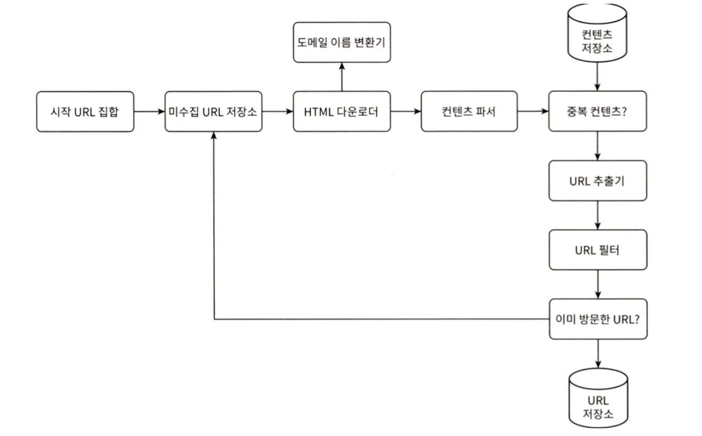
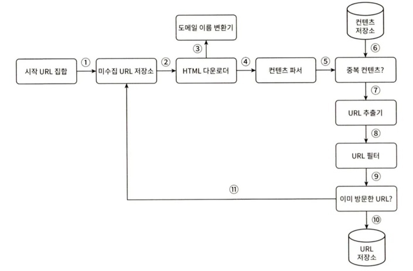
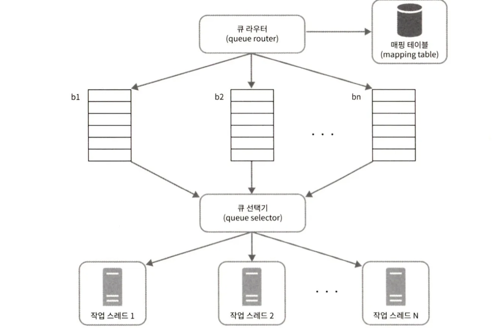
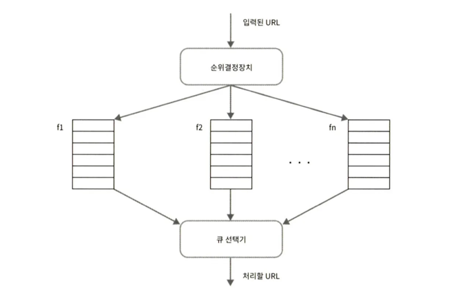
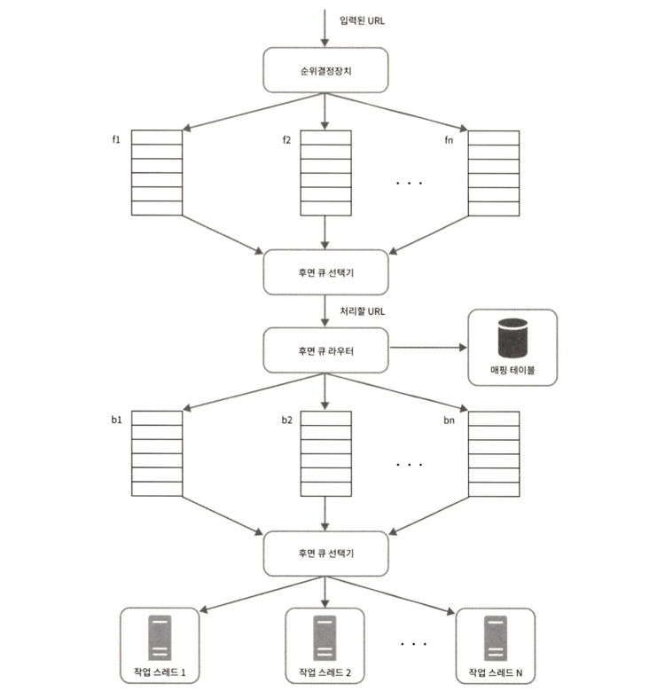
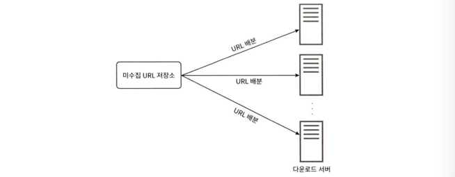
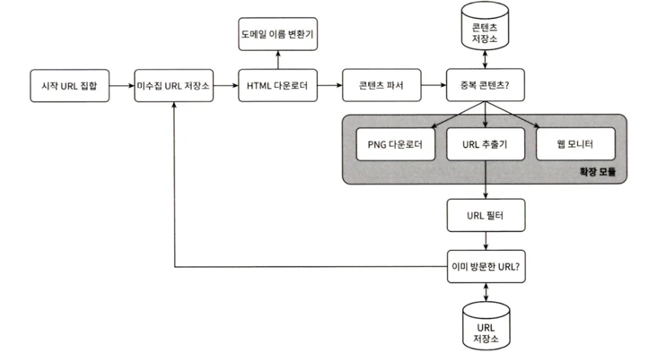

검색 엔진에서 쓰이는 기술로, 웹에 새로 올라오거나 갱신된 콘텐츠(웹 페이지, 이미지, 비디오, PDF 파일 등)를 찾아내는 것이 주된 목적이다. 

웹 크롤러는 몇 개 웹 페이지에서 시작하여 그 링크를 따라 나가면서 새로운 콘텐츠를 수집한다.

크롤러 사례

- 검색 엔진 인덱싱 (search engine indexing) : 가장 보편적. 크롤러는 웹 페이지를 모아 검색 엔진을 위한 로컬 인덱스(local index)를 만든다. Googlebot은 구글 검색 엔진이 사용하는 웹 크롤러다.
- 웹 아카이빙 (web archiving) : 나중에 사용할 목적으로 장기보관하기 위해 모은다. 대표적으로 미국 국회 도서관, EU 웹 아카이브가 있다.
- 웹 마이닝 (web mining) : 유명 금융 기업들은 크롤러를 사용해 주주총회 자료나 연차 보고서를 다운받아 기업의 핵심 사업 방향을 알아내기도 한다.
- 웹 모니터링 (web monitoring) : 크롤러로 저작권이나 상표권이 침해되는 사례를 모니터링할 수 있다.

웹 크롤러의 복잡도는 웹 크롤러가 처리해야 하는 데이터의 규모에 따라 달라진다.

## 1단계 문제 이해 및 설계 범위 확정

### 웹 크롤러의 알고리즘

1. URL 집합이 입력으로 주어지면, 해당 URL 들이 가라키는 모든 웹 페이지를 다운로드한다.
2. 다운받은 웹 페이지에서 URL들을 추출한다.
3. 추출된 URL들을 다운로드할 URL 목록에 추가하고 위의 과정을 처음부터 반복한다.

### 좋은 크롤러의 속성
- 규모 확장성 : 병행성 활용.
- 안정성 : 잘못 작성된 HTML, 아무 반응이 없는 서버, 장애, 악성 코드가 붙어 있는 링크 등 대응 필요.
- 예절 : 수집 대상 웹 사이트에 짧은 시간 동안 너무 많은 요청을 보내지 않기.
- 확장성 : 새로운 형태의 콘텐츠(이미지 등)를 지원하기가 쉬워야 함.

### 개략적 규모 추정

- 매달 10억 개의 웹 페이지를 다운로드한다.
- QPS = 10억 / 30일 / 24시간 / 3600초 = 대략 400페이지/초
- 최대(Peak) QPS = 2*QPS = 800
- 웹 페이지의 크기 평균은 500k라고 가정
- 10억 페이지 * 500k = 500TB/월. (2장 다시 읽기)
- 1개월 치 데이터를 보관하는 데는 500TB, 5년간 보관한다고 가정하면 결굴 500TB * 12개월 * 5년 = 30PB의 저장용량이 필요할 것이다.

## 2단계 개략적 설계안 제시 및 동의 구하기

[4][5] 참고.

- 시작 URL 집합
  - 가능한 많은 링크를 탐색할 수 있도록 하는 URL을 골라야 한다.
  - 또는 주제별로 예를 들어 URL 공간을 쇼핑, 스포츠 등등의 주제별로 세분화하고 그 각각에 다른 시작 URL을 쓴다.
- 미수집 URL 저장소
  - ‘다운로드할 URL’ 을 저장 관리하는 컴포넌트를 미수집 URL 저장소라고 부른다. FIFO 큐.
- HTML 다운로더
  - 웹 페이지를 다운로드하는 컴포넌트.
- 도메인 이름 변환기
  - HTTP 다운로더는 도메인 이름 변환기를 사용하여 URL 에 대응되는 IP 주소를 알아낸다.
- 콘텐츠 파서
  - 파싱과 검증. 이상한 웹 페이지는 거른다.
  - 크롤링 서버 안에 콘텐츠 파서를 구현하면 크롤링 과정이 느려질 수 있으므로, 독립된 컴포넌트로 만들었다.
- 중복 콘텐츠인가? 
  - 연구 결과에 따르면 29% 가량의 웹 페이지 콘텐츠는 중복이다. 
  - 문자열 비교는 비효율적이므로 웹 페이지의 해시 값을 비교한다.
- 콘텐츠 저장소 
  - 콘텐츠 저장소는 HTML 문서를 보관하는 시스템이다.
  - 데이터 양이 많아 대부분의 콘텐츠는 디스크에 저장하고, 인기 있는 콘텐츠는 메모리에 두어 접근 지연시간을 줄인다.
- URL 추출기 
  - HTML 페이지를 파싱하여 링크들을 골라낸다. 
  - 상대 경로를 절대 경로로 변환한다.
- URL 필터 
  - 특정 콘텐츠 타입, 파일 확장자를 갖는 URL, 오류 URL, 접근 제외 목록(deny list)에 포함된 URL 등을 크롤링 대상에서 제외한다.
- 이미 방문한 URL?
  - URL을 여러 번 처리하는 일을 방지. 
  - 블룸 필터(bloom filter)나 해시 테이블이 널리 쓰인다. ([4][8])
- URL 저장소 
  - 이미 방문한 URL을 보관하는 저장소.

### 웹 크롤러 작업 흐름

1. 시작 URL 들을 미수집 URL 저장소에 저장한다.
2. HTML 다운로더가 미수집 URL 저장소에서 URL 목록을 가져온다.
3. HTML 다운로더에서 도메인 이름 변환기를 사용하여 URL의 IP 주소를 알아내고, 해당 IP 주소로 접속하여 웹 페이지를 다운받는다.
4. 콘텐츠 파서는 다운된 HTML 페이지를 검증한다.
5. 콘텐츠 파싱과 검증이 끝나면 중복 컨텐츠인지 확인한다.
6. 중복 콘텐츠인지 확인하기 위해, 해당 페이지가 이미 저장소에 있는지 본다.
    - 이미 저장소에 있는 콘텐츠인 경우에는 버린다.
    - 저장소에 없는 콘텐츠인 경우에는 저장소에 저장한 뒤 URL 추출기로 전달한다.
7. URL 추출기는 해당 HTML 페이지에서 링크를 골라낸다.
8. 골라낸 링크를 URL 필터로 전달한다.
9. 중복 URL 인짖 확인한다.
10. 이미 처리한 URL인지 확인하기 위하여, URL 저장소에 보관된 URL인지 확인한다. 이미 저장소에 있는 URL은 버린다.
11. 저장소에 없는 URL은 URL 저장소, 미수집 URL 저장소에 전달한다.

## 3단계 상세 설계

- DFS(Depth-First Seach) vs BFS(Breath-First Seach)
- 미수집 URL 저장소
- HTML 다운로더
- 안정성 확보 전략
- 확장성 확보 전략
- 문제 있는 콘텐츠 감지 및 회피 전략

### DFS vs BFS

- DFS 는 그래프 크기가 클 경우 어느 정도로 깊숙이 가게 될지 가늠하기 어렵다.
- 그래서 웹 크롤러는 보통 BFS 너비 우선 탐색법을 사용한다.
- BFS 단점
  - 크롤러는 같은 호스트에 속한 링크들을 다운받는데 병렬로 처리할 경우 서버가 과부하에 걸릴 것이다.
  - 표준적 BFS 알고리즘은 URL 간에 우선순위를 두지 않는다. 페이지 순위, 사용자 트래픽의 양, 업데이트 빈도 등 우선순위를 구별해야 한다.

### 미수집 URL 저장소

URL 저장소는 다운로드할 URL을 보관하는 장소다. 

이 저장소를 잘 구현하면 ‘예의(politeness)’를 갖춘 크롤러, URL 사이의 우선순위와 신선도(freshness)를 구별하는 크롤러를 구현할 수 있다.

([5][9] 참고)

**예의**

- 수집 대상 서버로 짧은 시간 안에 너무 많은 요청을 보내면, Dos 공격으로 간주될 수 있다. 
- 그래서 동일 웹 사이트에 대해서는 한 번에 한 페이지만 요청한다.

- 설계
    - 큐 라우터 : 같은 호스트에 속한 URL은 언제나 같은 큐로 가도록 보장한다.
    - 매핑 테이블 : 호스트 이름과 큐 사이의 관계를 보관하는 테이블.
    - FIFO 큐(b1부터 bn까지) : 같은 호스트에 속한 URL은 언제나 같은 큐에 보관된다.
    - 큐 선택기(queue selector) : 큐를 순회하며 URL을 꺼내서 URL을 다운로드하도록 지정된 작업 스레드에 전달한다.
    - 작업 스레드(worker thread) : 전달된 URL을 다운로드한다. 순차 처리하며, 작업들 사이에 일정한 지연시간(delay)을 둘 수 있다.

**우선순위**

- 애플 제품에 대한 사용자 의견이 올라오는 포럼의 한 페이지와 애플 홈페이지는 같은 중요도를 갖기는 어려울 것이다. 애플 홈페이지를 먼저 수집하도록 하는 것이 바람직할 것이다.
- 페이지랭크(PageRank), 트래픽 양, 갱신 빈도(update frequency) 등으로 우선순위를 구한다.
- 순위결정장치(prioritizer)는 URL 우선순위를 정하는 컴포넌트다. ([5][10]).

- 순위결정장치 : URL을 입력으로 받아 우선순위를 계산한다.
- 큐(f1, …, fn) : 우선순위별로 큐가 하나씩 할당된다. 
- 큐 선택기 : 임의 큐에서 처리할 URL을 꺼낸다. 순위가 높은 큐에서 더 자주 꺼낸다.

- 전체 설계

  - 전면 큐(front queue) : 우선순위 결정 과정을 처리한다.
  - 후면 큐(back queue) : 크롤러가 예의 바르게 동작하도록 보증한다.

**신선도**

-이미 다운로드한 페이지라고 해도 주기적으로 재수집할 필요가 있다.
    - 웹 페이지의 변경 이력(update history) 활용
    - 우선순위를 활용하여, 중요한 페이지는 좀 더 자주 재수집

**미수집 URL 저장소를 위한 지속성 저장장치**

- 검색 엔진을 위한 크롤러의 경우, 처리해야 하는 URL의 수는 수억 개에 달한다.
- 대부분의 URL은 디스크에 두지만 IO 비용을 줄이기 위해 메모리 버퍼에 큐를 두어 성능과 안정성을 높인다.
- 버퍼에 있는 데이터는 주기적으로 디스크에 기록한다.

### HTML 다운로더

**Robots.txt**

- 이 파일에는 크롤러가 수집해도 되는 페이지 목록이 들어 있다. 크롤러는 웹 사이트를 긁어 가기 전에 해당 파일에 나열된 규칙을 먼저 확인해야 한다.
- Robots.txt 파일을 매번 다운로드하지 않기 위해, 주기적으로 다시 다운받아 캐시에 보관한다.
- Robots.txt 예시
    - User-agent: Googlebot
    - Disallow: /creatorhub/*
    - Disallow: /rss/people/*/reviews

**성능 최적화**

1. 분산 크롤링
    - 크롤링 작업을 여러 서버에 분산한다.
    - URL 공간은 작은 단위로 분할하여, 각 서버는 그중 일부의 다운로드를 담당하도록 한다.
      

2. 도메인 이름 변환 결과 캐시
    - 크롤러 성능의 병목 중 하나인데, DNS 요청을 보내고 결과를 받는 작업의 동기적 특성 때문이다.
    - 그래서 도메인 이름과 IP 주소 사이의 관계를 캐시에 보관하고, 크론 잡(cron job) 등을 돌려 주기적으로 갱신하도록 하면 성능을 높일 수 있다.
3. 지역성
    - 크롤링 작업을 수행하는 서버를 지역별로 분산하는 방법이다.
    - 크롤링 서버가 크롤링 대상 서버와 지역적으로 가까우면 페이지 다운로드 시간은 줄어들 것이다. 
    - 크롤링 서버, 캐시, 큐, 저장소 등 대부분의 컴포넌트에 적용 가능하다.
4. 짧은 타임아웃
    - 특정 시간 동안 서버가 응답하지 않으면 크롤러는 해당 페이지 다운로드를 중단하고 다음 페이지로 넘어간다.

**안정성**

- 안정 해시 : 다운로더 서버들에 부하를 분산할 때 적용 가능한 기술이다. 다운로더 서버를 쉽게 추가하고 삭제할 수 있다. (5장 참고)
- 크롤링 상태 및 수집 데이터 저장 : 장애가 발생한 경우에도 쉽게 복구할 수 있도록 크롤링 상태와 수집된 데이터를 저장장치에 기록해 둬야한다.
- 예외 처리 : 예외가 발생해도 전체 시스템이 중단되면 안된다.
- 데이터 검증 : 시스템 오류를 방지한다.

**확장성**

- 새로운 모듈을 끼워 넣음으로써 새로운 형태의 콘텐츠(PNG)를 지원할 수 있게 되었다.
- 웹 모니터는 웹을 모니터링하여 저작권이나 상표권이 침해되는 일을 막는 모듈이다.

**문제 있는 콘텐츠 감지 및 회피**

1. 중복 콘텐츠
    - 웹 콘텐츠의 30% 가량은 중복이다. 해시나 체크섬을 사용하면 중복 콘텐츠를 보다 쉽게 탐지할 수 있다([11])
2. 거미 덫
    - 거미 덫은 크롤러를 무한 루프에 빠뜨리도록 설계한 웹 페이지다. 예를 들어 /exmaple.com/foo/bar/foo/bar/… 와 같이 무한히 깊은 디렉토리 구조를 포함하는 링크가 있다고 해 보자.
    - 이런 덫은 URl 최대 길이를 제한하면 회피할 수 있다. 하지만 모든 종류의 덫을 피하기는 어렵다. 
    - 사람이 수작업으로 덫을 확인하고, 덫이 있는 사이트를 크롤러 탐색 대상에서 제외하거나 URL 필터 목록에 걸어두는 방법이 있다.
3. 데이터 노이즈
    - 광고나 스크립트 코드, 스팸 URL 같은 것은 가치가 없다.

## 4단계 마무리

추가 논의해볼 만한 부분
- 서버 측 렌더링
  - 자바스크립트, AJAX 등의 기술을 사용해 링크를 즉석에서 만들어 내면, 링크는 발견할 수 없을 것이다. 
  - 페이지 파싱 전 서버 측 렌더링(동적 렌더링)을 적용하면 해결할 수 있다([12])
- 원치 않는 페이지 필터링
  - 스팸 방지 컴포넌트를 두어 품질이 조악하거나 스펨성인 페이지를 걸러내도록 해 두면 좋다.
- 데이터베이스 다중화 및 샤딩
  - 다중화나 샤딩 같은 기법을 적용하면 데이터 계층의 가용성, 규모 확장성, 안정성이 향상된다.
- 수평적 규모 확장성
  - 대규모의 크롤링을 위해서는 다운로드를 실행할 서버가 수백 혹은 수천 대 필요할 수도 있다. 
  - 무상태(stateless) 서버로 만들어야 한다.
- 가용성, 일관성, 안정성
  - 대형 시스템을 위해서는 필수로 고려해야 한다. (1장)
- 데이터 분석 솔루션
  - 시스템을 세밀히 조정하기 위해서는 이런 데이터와 그 분석 결과가 필수적이다.