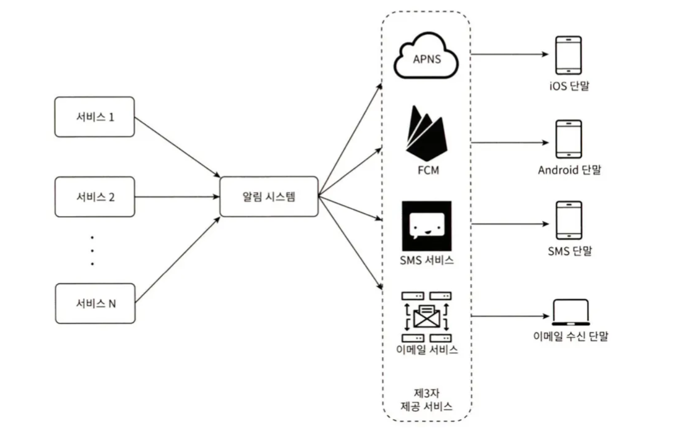
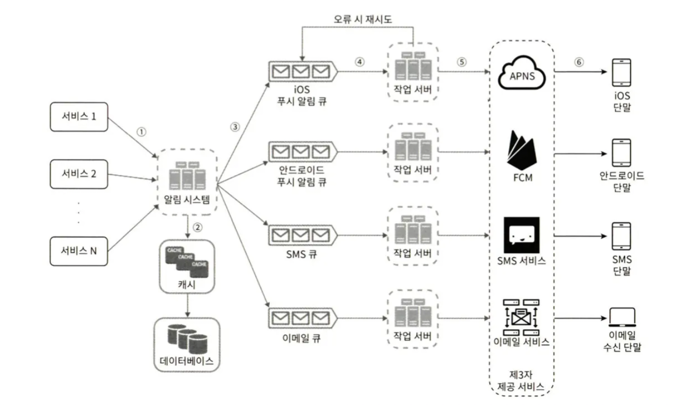
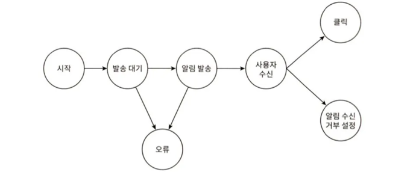
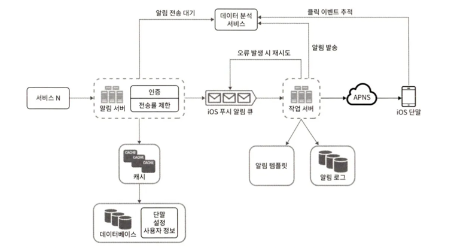

알림 시스템은 모바일 푸시 알림, SMS 메시지, 이메일 세 가지로 분류할 수 있다.

## 1단계 문제 이해 및 설계 범위 확정

- 지원해야 하는 알림 : 모바일 푸시 알림, SMS 메시지, 이메일
- 약간의 지연은 무방
- iOS, 안드로이드, 랩톱/데스크톱 지원 필요
- 클라이언트 애플리케이션 또는 서버에서 스케줄링하여 알림 생성
- 알림 받지 않도록 설정하는 기능
- 하루에 천만 건의 모바일 푸시 알림, 백만 건의 SMS 메시지, 5백만 건의 이메일 발송 지원

## 2단계 개략적 설계안 제시 및 동의 구하기

### 알림 유형별 지원 방안

**iOS 푸시 알림**

- 알림제공자 → APNS → iOS 단말

- 알림 제공자
  - 알림 요청을 만들어 애플 푸시 알림 서비스(APNS : Apple Push Notification Service)로 보내는 주체다.
  - 단말 토큰, 페이로드가 필요하다.
- APNS
  - 애플이 제공하는 원격 서비스다. 푸시 알림을 iOS 장치로 보내는 역할을 담당한다.

**안드로이드 푸시 알림**

- 알림 제공자 → FCM → 안드로이드 단말
- APNS 대신 FCM(Firebase Cloud Messaging)을 사용한다.

**SMS 메시지**

- 알림 제공자 → SMS 서비스 → SMS 수신 단말
- 트윌리오(Twilio), 넥스모(Nexmo) 같은 제3사업자의 서비스를 많이 이용한다. 대부분 이용요금을 내야 한다.

**이메일**

- 알림 제공자 → 이메일 서비스 → 이메일 수신 단말
- 많은 회사가 상용 이메일 서비스를 이용한다.

**연락처 정보 수집 절차**

- 사용자가 앱을 설치하거나 처음으로 계정을 등록하면 API 서버는 해당 사용자의 정보(모바일 단말 토큰, 전화번호, 이메일 주소 등)를 수집하여 데이터베이스에 저장한다.
- 한 사용자가 여러 단말을 가질 수 있고, 알림은 모든 단말에 전송되어야 한다.

### **알림 전송 및 수신 절차**

**개략적 설계안 (초안)**

- 1부터 N까지의 서비스 : 마이크로서비스, 크론잡, 분산 시스템 컴포넌트, 과금 서비스, 배송알림을 보내려는 쇼핑몰 웹사이트 등의 서비스다.
- 알림 시스템 : 서비스 1~N에 알림 전송을 위한 API를 제공하고, 제3자 서비스에 전달할 알림 페이로드를 만들어낼 수 있어야 한다.
- 제3자 서비스 : 사용자에게 알림을 실제로 전달한다. 제 3자 서비스와의 통합을 진행할 때 유의할 것은 확장성이다. 쉽게 새로운 서비스를 통합하거나 기존 서비스를 제거할 수 있어야 한다는 뜻이다. 

이 설계에는 몇 가지 문제가 있다.

- SPOF(SIngle Point of Failure) : 알림 서버가 하나밖에 없다면, 그 서버에 장애가 생기면 전체 서비스의 장애로 어어진다.
- 규모 확장성 : 한 대 서비스로 푸시 알림에 관계된 모든 것을 처리하므로, 데이터베이스나 캐시 등 중요 컴포넌트의 규모를 개별적으로 늘릴 방법이 없다.
- 성능 병목 : 한 서버로 처리하면 사용자 트래픽이 많이 몰리는 시간에는 시스템이 과부하 상태에 빠질 수 있다.

**개략적 설계안 (개선된 버전)**

- 데이터베이스와 캐시를 알림 시스템의 주 서버에서 분리한다.
- 알림 서버를 증설하고 자동으로 수평적 규모 확장이 이루어질 수 있도록 한다.
- 메시지 큐를 이용해 시스템 컴포넌트 사이의 강한 결합을 끊는다.

설명
- 알림 서버
    - 알림 전송 API
    - 알림 검증 : 이메일 주소, 전화번호 등에 대한 기본적 검증을 수행한다.
    - 데이터베이스 또는 캐시 질의 : 알림에 포함시킬 데이터를 가져온다.
    - 알림 전송 : 알림 데이터를 메시지 큐에 넣는다. 병렬적으로 처리할 수 있다.
- 캐시 : 사용자 정보, 단말 정보, 알림 템플릿 등을 캐시한다.
- 데이터베이스 : 사용자, 알림, 설정 등 다양한 정보를 저장한다.
- 메시지 큐
  - 시스템 컴포넌트 간 의존성을 제거하기 위해 사용한다. 
  - 다량의 알림이 전송되어야 하는 경우를 대비한 버퍼 역할도 한다. 
  - 제 3자 서비스 가운데 하나에 장애가 발생해도 다른 종류의 알림은 정상 동작한다.
- 작업 서버 : 메시지 큐에서 전송할 알림을 꺼내 제3자 서비스로 전달한다.
- 제3자 서비스 : APNS, FCM 등

알림 전송 순서

1. API를 호출하여 알림 서버로 알림을 보낸다.
2. 알림 서버는 사용자 정보, 단말 토큰, 알림 설정 같은 메타데이터를 캐시나 데이터베이스에서 가져온다.
3. 알림 서버는 전송할 알림에 맞는 이벤트를 만들어서 해당 이벤트를 위한 큐에 넣는다. 예를 들어 iOS 푸시 알림 이벤트는 iOS 푸시 알림 큐에 넣는다.
4. 작업 서버는 메시지 큐에서 알림 이벤트를 꺼낸다.
5. 작업 서버는 알림을 제3자 서비스로 보낸다.
6. 제3자 서비스는 사용자 단말로 알림을 전송한다.

## 3단계 상세 설계

- 안정성(reliability)
- 추가로 필요한 컴포넌트 및 고려사항 : 알림 템플릿, 알림 설정, 전송률 제한(rate limiting), 재시도 메커니즘(retry mechanism), 보안(security), 큐에 보관된 알림에 대한 모니터링과 이벤트 추적 등이 이에 해당한다.
- 개선된 설계안

### 안전성

**데이터 손실 방지**
- 어떤 사황에서도 알림이 소실되면 안된다.
- 알림 시스템은 알림 데이터를 데이터베이스에 보관하고 재시도 메커니즘을 구현해야 한다. 알림 로그 데이터베이스를 유지하는 것이 한 가지 방법이다.
  

**알림 중복 전송 방지**

- 같은 알림이 여러 번 반복되는 것을 완전히 막는 것은 가능하지 않다([5] 참고).
- 빈도를 줄이려면 중복을 탐지하는 메커니즘을 도입하고, 오류를 신중하게 처리해야 한다.
- 간단한 중복 방지 로직의 사례
  - 보내야할 알림이 도착하면 그 이벤트 ID를 검사하여 이전에 본 적이 있는 이벤트인지 살핀다. 
  - 중복된 이벤트라면 버리고, 그렇지 않으면 알림을 발송한다.

### 추가로 필요한 컴포넌트 및 고려사항

**알림 템플릿**

- 알림 메시지 대부분은 형식이 비슷하다. 보통 파라미터나 스타일, 추적 링크(tracking link)를 조정한다.
- 템플릿을 사용하면 전송될 알림들의 형식을 일관성 있게 유지할 수 있고, 오류 가능성뿐 아니라 알림 작성에 드는 시간도 줄일 수 있다.

**알림 설정**

- 사용자가 알림 설정을 상세히 조정할 수 있도록 한다. 
- 알림 설정 테이블에 보관된다.

**전송률 제한**

- 사용자에게 너무 많은 알림을 보내지 않도록 하는 한 가지 방법은, 한 사용자가 받을 수 있는 알림의 빈도를 제한하는 것이다. 
- 알림을 너무 많이 보내기 시작하면 사용자가 알림 기능을 아예 꺼 버릴 수도 있기 때문이다.

**재시도 방법**

- 제3자 서비스가 알림 전송에 실패하면, 해당 알림을 재시도 전용 큐에 넣는다. 
- 같은 문제가 계속해서 발생하면 개발자에게 통지한다.

**푸시 알림과 보안**

- iOS와 안드로이드 앱의 경우, 알림 전송 API는 appKey와 appSecret을 사용하여 보안을 유지한다. 
- 인증된, 혹은 승인된 클라이언트에만 해당 API를 사용하여 알림을 보낼 수 있다. ([6])

**큐 모니터링**

- 큐에 쌓인 알림의 개수가 너무 크면 작업 서버들이 이벤트를 빠르게 처리하고 있지 못하다는 뜻이다. 
- 이 경우 작업 서버를 증설해야할 것이다.

**이벤트 추적**

- 알림 확인율, 클릭율, 실제 앱 사용으로 이어지는 비율 같은 메트릭은 사용자를 이해하는데 중요하다. 
- 데이터 분석 서비스는 보통 이벤트 추적 기능도 제공한다. 따라서 보통 알림 시스템을 만들면 데이터 분석 서비스와도 통합해야만 한다.
  

### 수정된 설계안

- 알림 서버에 인증(authentication)과 전송률 제한(rate-limiting) 기능이 추가되었다.
- 전송 실패에 대응하기 위한 재시도 기능이 추가되었다. 전송에 실패한 알림은 다시 큐에 넣고 지정된 횟수만큼 재시도한다.
- 전송 템플릿을 사용하여 알림 생성 과정을 단순화하고 알림 내용의 일관성을 유지한다.
- 모니터링과 추적 시스템을 추가하여 시스템 상태를 확인하고 추후 시스템을 개선하기 쉽도록 하였다.

## 4단계 마무리

- 안전성(reliability) : 메시지 전송 실패율을 낮추기 위해 안정적인 재시도 메커니즘을 도입하였다.
- 보안(security) : 인증된 클라이언트만이 알림을 보낼 수 있도록 appKey, appSecret 등의 메커니즘을 이용하였다.
- 이벤트 추적 및 모니터링 : 알림이 만들어진 후 성공적으로 전송되기까지의 과정을 추적하고 모니터링할 수 있는 시스템을 통합하였다.
- 사용자 설정 : 사용자가 알림 수신 설정을 조정할 수 있도록 하였다. 알림을 보내기 전 반드시 해당 설정을 확인하도록 시스템 설계를 변경하였다.
- 전송률 제한 : 사용자에게 알림을 보내는 빈도(frequency)를 제한할 수 있도록 하였다.

## 참고문헌

[5] You Cannot Have Exactly-Once Delivery : https://bravenewgeek.com/you-cannot-have-exactly-once-delivery/

- 분산시스템에서는 at-excatly-once 가 불가능하다. 
  - 세가지 타입이 있는데 앞의 두 개는 실행 가능하고 널리 사용되고 있다.
    - at-most-once : 최대 한번
    - at-least-once : 최소 한번
    - at-exactly-once : 정확히 한번 
  - 기술적으로 at-least-once 도 불가능할 수 있다. 
    - 만약 connection 이 끊기면 아무것도 전달할 수 없다. 그래서 우리는 at-least-once 를 고려한다. 
  - 분산시스템에서 메시지를 보내고 응답받기를 기다리면 문제가 발생할 수 있다. 
  - 처리전에 메시지가 손실되거나 처리중 메시지가 손실되면 메시지는 도달할 수 없는 뷰가 **at-most-once** 이다. 
    - 구현이 복잡하다. 
    - 메시지가 워커에게 도착했다면 다른 워커들에는 도달하지 않아야 하기 때문에 강한 일관성(CPA에서 CP)이 유지되어야 한다(카프카에서는 주키퍼). 
  - at-least-once 는 시스템에 부하가 있을 수 있다. 
    - 빠르거나 일관성있다.
    - 보장을 제공하는 주요한 메시지 큐들은 at-least-once delivery 다. 만약 at-exactly-once를 주장한다면 거짓말이다. 
    - RabbitMQ는 아래 내용을 보장하기 위해 시도한다.
      - 확인할 때 채널이나 커넥션 실패를 복구하는 producers는 broker로부터 확인되지 않은 모든 메시지를 다시 전송해야 한다. 
      - 이때 메시지가 중복될 수 있는데, 브로커가 producer 에게 도달하지 않은 확인을 보냈을 수 있기 때문이다(네트워크 장애 등으로 인해). 
      - 따라서 consumer 애플리케이션은 중복 제거를 수행하거나 멱등 방식으로 메시지를 처리해야 한다.
      - 어쨌든 우리가 추구하는 것은 일반적으로 인과적 순서 지정다. 
  - 반복해서 말하자면, 정확히 한 번 전달이라는 것은 없다. 
    - 대부분의 경우 최소 한 번 전달 중에서 선택해야 한다. 
    - 비동기적 특성에 대비하여 실패와 회복성을 설계해야 한다. 
  - 요약
    - **최소 한 번(at-least-once)** 또는 **최대 한 번(at-most-once)** 전달 보장이 현실적입니다. 
    - 최소 한 번 전달은 메시지가 한 번 이상 전달될 수 있으므로, 수신 측에서 멱등성(idempotency)을 통해 중복 처리를 방지해야 합니다. 
    - 최대 한 번 전달은 메시지가 손실될 수 있음을 의미하므로, 중요한 데이터의 경우 적합하지 않을 수 있습니다.
    - 결론적으로, 분산 시스템 설계 시 정확히 한 번 전달보다는 멱등성을 고려한 최소 한 번 전달 보장을 통해 신뢰성을 높이는 것이 중요합니다.
- FLP 와 Two Generals Problem 이란?
  - Two Generals Problem은 네트워크에서 신뢰할 수 있는 통신을 보장하는 것이 불가능함을 증명하는 고전적인 문제입니다.
  - FLP 정리는, Fischer, Lynch, Paterson이 1985년에 증명한 이 정리는 "비동기 환경에서 최소한 한 명의 노드가 장애를 겪을 가능성이 있다면, 분산 시스템에서 완벽한 합의를 보장하는 결정론적 알고리즘은 존재할 수 없다"는 것을 말합니다.
  - 결국, 분산 시스템에서는 100% 확실한 합의는 불가능하지만, 확률적으로 높은 신뢰도를 갖춘 알고리즘이 필요하다.
  - 즉, Two Generals Problem은 메시지 전달이 100% 보장되지 않는 환경에서 합의가 어려운 이유를 설명하는 고전적인 문제이고, FLP 정리는 이를 더 일반화하여 "비동기 분산 시스템에서는 완전한 합의가 불가능함"을 수학적으로 증명한 것입니다.

[6] Security in Push Notifications : https://cloud.ibm.com/docs/services/mobilepush?topic=mobile-pushnotification-security-in-push-notifications
