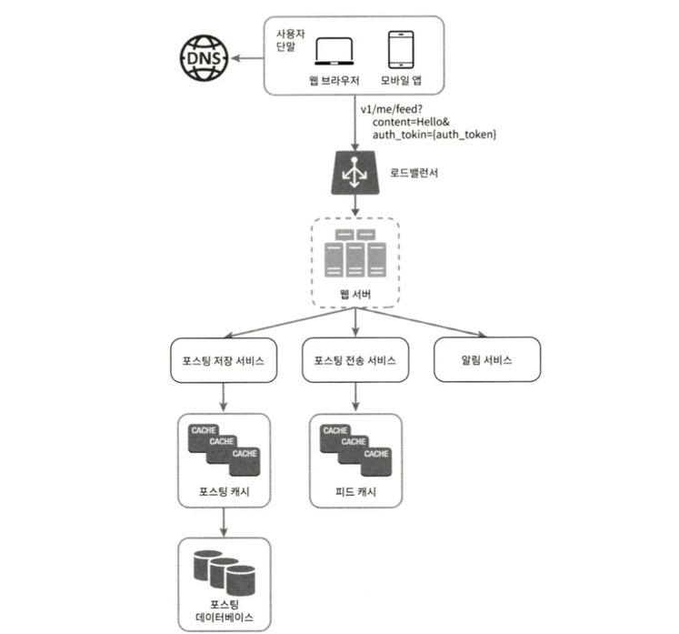
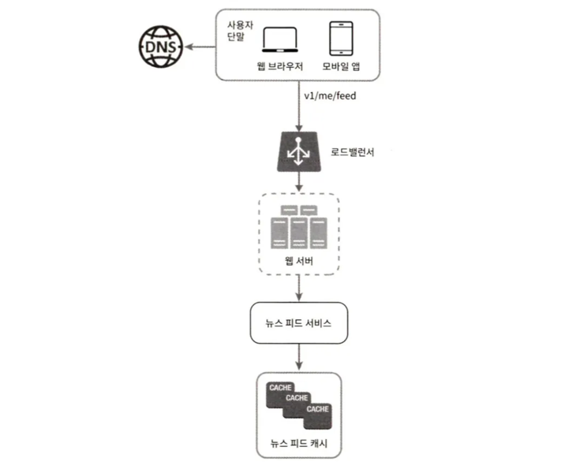
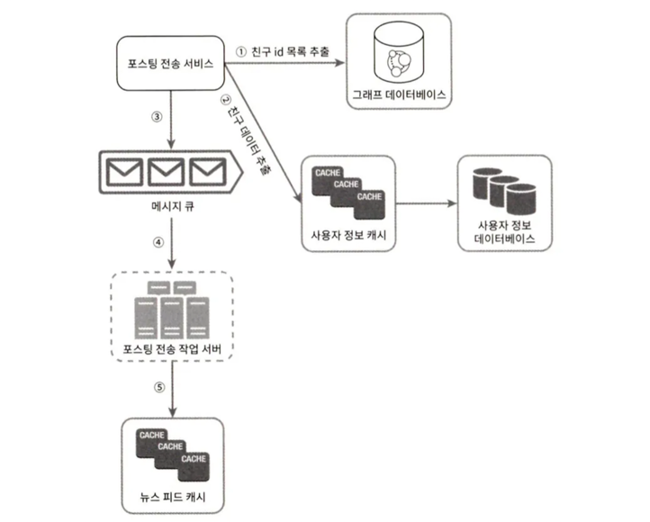
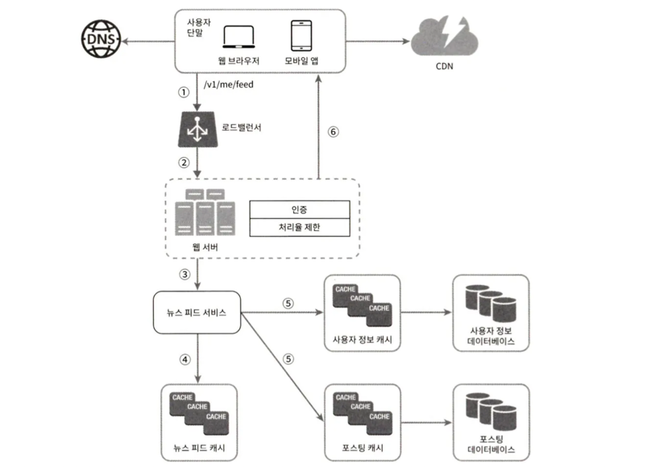
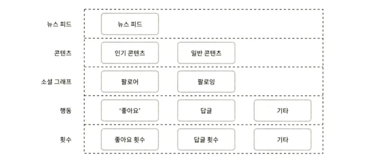

페이스북에서 “뉴스 피드는 여러분의 홈 페이지 중앙에 지속적으로 업데이트되는 스토리들로, 사용자 상태 정보 업데이트, 사진, 비디오, 링크, 앱 활동, 팔로우하는 사람들, 페이지, 좋아요 등을 포함한다”고 설명하고 있다.

## 1단계 문제 이해 및 설계 범위 확정

- 모바일 앱, 웹 둘 다 지원
- 사용자가 뉴스 피드를 올리고, 친구들 스토리를 볼 수 있어야 함
- 뉴스 피드는 시간 흐름 역순
- 한 명의 사용자는 최대 5,000명 친구
- 매일 천만 명 방문
- 피드는 이미지, 비디오 등의 미디어 파일도 가능

## 2단계 개략적 설계안 제시 및 동의 구하기

- 피드 발행
  - 사용자가 스토리를 포스팅하면 캐시와 데이터베이스에 기록한다. 새 포스팅은 친구의 뉴스 피드에도 전송된다.
- 뉴스 피드 생성
  - 본 설계안에서는 시간 흐름 역순으로 모아서 만든다.

### 뉴스 피드 API

**피드 발행 API**
- 새 스토리를 포스팅하기 위한 API 다.
- POST /v1/me/feed 
  - Authorization 헤더 : API 호출을 인증하기 위해 사용
  - 바디 : 포스팅 내용

**피드 읽기 API**
- 뉴스 피드를 가져오는 API 다.
- GET /v1/me/feed 
  - Authorization 헤더 : API 호출을 인증하기 위해 사용.

### 피드 발행

- 웹 서버 : HTTP 요청을 내부 서비스로 중계한다.
- 포스팅 저장 서비스(post service) : 새 포스팅을 데이터베이스와 캐시에 저장한다.
- 포스팅 전송 서비스(fanout service) : 새 포스팅을 친구의 뉴스 피드에 푸시(push)한다. 뉴스 피드 데이터는 캐시에 보관하여 빠르게 읽어갈 수 있도록 한다.
- 알림 서비스(notification service) : 친구들에게 새 포스팅이 올라왔음을 알리거나, 푸시 알림을 보내는 역할을 담당한다.

### 뉴스 피드 생성

- 뉴스 피드 서비스 : 캐시에서 뉴스 피드를 가져온다.
- 뉴스 피드 캐시 : 뉴스 피드를 렌더링할 때 필요한 피드 ID를 보관한다.

## 3단계 상세 설계

### 피드 발행 흐름 상세 설계

대부분의 컴포넌트는 개략적 설계안에서 다룬 정도로 충분하다. 웹 서버와 포스팅 전송 서비스(fanout service)에 초점을 맞추었다.

**웹 서버**

클라이언트와 통신할 뿐 아니라 인증이나 처리율 제한 등의 기능도 수행한다. 

**포스팅 전송(팬아웃) 서비스**

팬아웃은 어떤 사용자의 새 포스팅을 그 사용자와 친구 관계에 있는 모든 사용자에게 전달하는 과정이다.

팬아웃에는 두 가지 모델이 있는데 하나는 쓰기 시점에 팬아웃(fanout-on-write)하는 모델이고(푸시push 모델이라고도 함), 다른 하나는 읽기 시점에 팬아웃(fanout-on-read)하는 모델이다(풀pull 모델이라고도 함). 

- 쓰기 시점에 하는 팬아웃하는 모델 : 새로운 포스팅을 기록하는 시점에 뉴스 피드를 갱신하게 된다. 포스팅이 완료되면 바로 해당 사용자의 캐시에 해당 포스팅을 기록하는 것이다.
    - 장점
        - 뉴스 피드가 실시간으로 갱신되며 친구 목록에 있는 사용자에게 즉시 전송된다.
        - 뉴스 피드를 읽는 데 드는 시간이 짧아진다.
    - 단점
        - 친구가 많은 사용자의 경우 많은 친구들의 뉴스 피드를 갱신하는 데 많은 시간이 소요될 수도 있다. 핫키(hotkey) 문제.
        - 서비스를 자주 이용하지 않는 사용자의 피드까지 갱신해야 하므로 컴퓨팅 자원이 낭비된다.
- 읽기 시점에 팬아웃하는 모델 : 피드를 읽어야 하는 시점에 뉴스 피드를 갱신한다. 요청 기반(on-demand) 모델이다.
    - 장점
        - 비활성화된 사용자, 또는 서비스에 거의 로그인하지 않는 사용자의 경우에는 이 모델이 유리하다. 자원이 절약된다.
        - 핫키 문제도 생기지 않는다.
    - 단점
        - 뉴스 피드를 읽는 데 많은 시간이 소요될 수 있다.

**본 설계안은 두 가지를 결합하여 장점은 취하고 단점은 버리는 전략을 취한다.**

- 뉴스 피드를 빠르게 가져올 수 있도록 대부분의 사용자에 대해서는 푸시 모델을 사용한다.
- 친구나 팔로어가 아주 많은 사용자의 경우에는 풀 모델을 사용하여 시스템 과부하를 방지한다.
- 안정 해시를 통해 요청과 데이터를 보다 고르게 분산하여 핫키 문제를 줄인다.

1. 그래프 데이터베이스에서 친구 ID 목록을 가져온다. ([2])
2. 사용자 정보 캐시에서 친구들의 정보를 가져온다. 누군가의 피드 업데이트를 무시하기로 설정했다면 경우 걸러낸다.
3. 친구 목록과 새 스토리의 포스팅 ID를 메시지 큐에 넣는다.
4. 팬아웃 작업 서버가 메시지 큐에서 데이터를 꺼내어 뉴스 피드 데이터를 뉴스 피드 캐시에 넣는다. 뉴스 피드 캐시는 <포스팅 ID, 사용자 ID>의 순서쌍을 보관하는 매핑 테이블이다.

### 피드 읽기 흐름 상세 설계

이미지나 비디오 같은 미디어 콘텐츠는 CDN에 저장하여 빨리 읽어갈 수 있도록 하였다.

1. 사용자가 뉴스 피드를 읽으려는 요청을 보낸다. (/v1/me/feed).
2. 로드밸런서가 요청을 웹 서버 가운데 하나로 보낸다.
3. 웹 서버는 피드를 가져오기 위해 뉴스 피드 서비스를 호출한다.
4. 뉴스 피드 서비스는 뉴스 피드 캐시에서 포스팅 ID 목록을 가져온다.
5. 뉴스 피드에 표시할 사용자 이름, 사용자 사진, 포스팅 콘텐츠, 이미지 등을 사용자 캐시와 포스팅 캐시에서 가져와 완전한 뉴스 피드를 만든다.
6. 생성된 뉴스 피드를 JSON 형태로 클라이언트에게 보낸다. 클라이언트는 해당 피드를 랜더링한다.

### 캐시 구조

캐시는 뉴스 피드 시스템의 핵심 컴포넌트다. 본 설계안은 캐시를 다섯 계층으로 나눈다.

- 뉴스 피드 : 뉴스 피드의 ID를 보관한다.
- 콘텐츠 : 포스팅 데이터를 보관한다. 인기 콘텐츠는 따로 보관한다.
- 소셜 그래프 : 사용자 간 관계 정보를 보관한다.
- 행동(action) : 포스팅에 대한 사용자의 행위에 관한 정보를 보관한다. 포스팅에 대한 ‘좋아요’, 답글 등이 이에 해당한다.
- 횟수(counter) : ‘좋아요’ 횟수, 응답 수, 팔로어 수, 팔로잉 수 등의 정보를 보관한다.

## 4단계 마무리

추가적으로 고려해볼 만한 부분
- **데이터베이스 규모 확장**
  - 수직적 규모 확장 vs 수평정 규모 확장
  - SQL vs NoSQL
  - 주-부(master-slave) 다중화
  - 복제본(replica)에 대한 읽기 연산
  - 일관성 모델(consistency model)
  - 데이터베이스 샤딩(sharding)
- 웹 계층(web tier)을 무상태로 운영하기
- 가능한 한 많은 데이터를 캐시할 방법
- 여러 데이터 센터를 지원할 방법
- 메시지 큐를 사용하여 컴포넌트 사이의 결합도 낮추기
- 핵심 메트릭(key metric)에 대한 모니터링. 예를 들어 트래픽이 몰리는 시간대의 QPS(Queries per Second), 사용자가 뉴스 피드를 새로고침(refresh) 할 때의 지연시간 등.