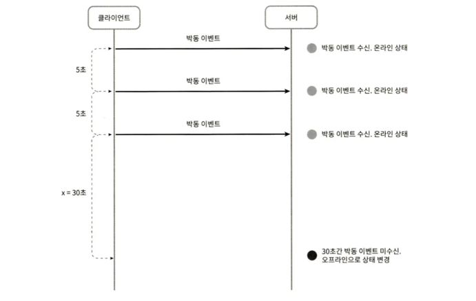

## 1단계 문제 이해 및 설계 범위 확정

페이스북 메신저, 위챗, 왓츠앱처럼 1:1 채팅에 집중하는 앱들이 있고, 슬랙 같은 그룹 채팅에 중점을 둔 업무용 앱이나, 게임 채팅에 쓰이는 디스코드 같이 대규모 그룹의 소통과 응답지연이 낮은 음성 채팅에 집중하는 앱도 있다.

설계 범위
- 응답지연이 낮은 일대일 채팅 기능
- 최대 100명까지 참여할 수 있는 그룹 채팅 기능
- 사용자의 접속상태 표시 기능
- 다양한 단말 지원. 하나의 계정으로 여러 단말에 동시 접속 지원
- 푸시 알림
- 5천만 DAU를 처리할 수 있도록 할 것

## 2단계 개략적 설계안 제시 및 동의 구하기

채팅 서버의 기본 기능

- 클라이언트들로부터 메시지 수신
- 메시지 수신자(recipient) 결정 및 전달
- 수신자가 접속 상태가 아닌 경우에는 접속할 때까지 해당 메시지 보관

채팅 서버의 네트워크 통신 프로토콜

- HTTP 프로토콜 
  - 클라이언트와 채팅 서비스와의 접속에는 keep-alive 헤더를 사용하면 효율적인데, 클라이언트와 서버 사이의 연결을 끊지 않고 계속 유지할 수 있어서다. TCP 접속 과정에서 발생하는 핸드셰이크 횟수도 줄일 수 있다. 
  - HTTP는 메시지 전송 용도로는 괜찮은 선택이며, 페이스북 같은 많은 대중적 채팅 프로그램이 초기에 HTTP를 사용했다.
  - 하지만 메시지 수신 시나리오는 더 복잡하다. 서버에서 클라이언트로 임의 시점에 메시지를 보내기 어렵다.

- 서버가 연결을 만드는 것처럼 동작하기 위한 방법 
  - 폴링 
    - 클라이언트가 주기적으로 서버에게 새 메시지가 있느냐고 물어보는 방법이다. 
    - 답해줄 메시지가 없는 경우에는 서버 자원이 불필요하게 낭비된다. 
  - 롱 폴링 
    - 롱 폴링의 경우 클라이언트는 새 메시지가 반환되거나 타임아웃 될 때까지 연결을 유지한다. 
    - 클라이언트는 새 메시지를 받으면 기존 연결을 종료하고 서버에 새로운 요청을 보내어 모든 절차를 다시 시작한다. 
    - 약점이 있다. 
      - 메시지를 보내는 클라이언트와 수신하는 클라이언트가 같은 채팅 서버에 접속하게되지 않을 수도 있다. 
      - 비효율적이다. 메시지를 많이 받지 않는 클라이언트도 타임아웃이 일어날 때마다 주기적으로 서버에 다시 접속할 것이다. 
  - **웹소켓** 
    - 서버가 클라이언트에게 비동기 메시지를 보낼 때 가장 널리 사용하는 기술이다. 
    - 웹소켓 연결은 클라이언트가 시작한다. 
    - 한번 맺어진 연결은 오래가며 양방향이다. 
    - 처음에는 HTTP 연결이지만 특정 핸드셰이크 절차를 거쳐 웹소켓 연결로 업그레이드된다. 
    - 웹소켓은 일반적으로 방화벽이 있는 환경에서도 잘 동작한다. 80이나 443처럼 HTTP 혹은 HTTPS 프로토콜이 사용하는 기본 포트번호를 그대로 쓴다.
    - 유의할 것은 웹소켓 연결은 오래 유지되어야 하기 때문에 서버 측에서 연결 관리를 효율적으로 해야 한다는 것이다.

### 개략적 설계안

웹소켓을 사용한다.

채팅 시스템은 무상태 서비스, 상태유지(stateful) 서비스, 제3자 서비스 연동의 세 부분으로 나누어 살펴볼 수 있다.

- 무상태 서비스
  - 무상태 서비스는 로그인, 회원가입, 사용자 프로파일 표시 등을 처리하는 전통적인 요청/응답 서비스다.
  - ‘service discovery’ 서비스는 클라이언트가 접속할 채팅 서버의 DNS 호스트명을 클라이언트에게 알려준다.
- 상태 유지 서비스
  - 채팅 서비스는 상태 유지가 필요하다. 
  - 클라이언트는 보통 서버가 살아있는 한 다른 서버로 연결을 변경하지 않는다. 
  - service discovery는 채팅 서비스와 긴밀히 협력해 특정 서버에 부하가 몰리지 않도록 한다.
- 제3자 서비스 연동
  - 푸시 알림이다. 
  - 새 메시지는 설사 앱이 실행중이지 않더라도 알림을 받아야 한다.
- 규모 확장성
  - 동시 접속자가 1M인 경우, 접속당 10K의 서버 메모리가 필요하다고 본다면 10GB 메모리만 있으면 모든 연결을 다 처리할 수 있을 것이다.
  - 하지만 서버 한 대는 SPOF 가 발생할 수 있다.

**설계**

- 채팅 서버는 클라이언트 사이에서 메시지를 중계한다.
- 접속상태 서버(presence server)는 사용자의 접속 여부를 관리한다.
- API 서버는 로그인, 회원가입, 프로파일 변경 등 그 외 나머지 전부를 처리한다.
- 알림 서버는 푸시 알림을 보낸다.
- 키-값 저장소에는 채팅 이력을 보관한다.

**저장소**

채팅 시스템의 데이터는 보통 두 가지다.

- 첫 번째는 사용자 프로파일, 설정, 친구 목록처럼 일반적인 데이터다. 
  - 안정성을 보장하는 관계형 데이터베이스에 보관한다. 
  - 다중화(replication)와 샤딩(sharding)은 가용성과 규모 확장성을 위해 필요하다.
- 두 번째 유형의 데이터는  채팅 이력이다. 
  - **읽기/쓰기 연산 패턴을 이해해야 한다.**
  - 채팅 이력 데이터의 양은 엄청나다. ([2] 페이스북 메신저나 왓츠앱은 매일 600억 개의 메시지를 처리)
  - 사용자는 대체로 최근에 주고받은 메시지 데이터만 보거나, 검색 기능을 이용하거나, 특정 사용자가 언급된 메시지를 보거나, 특정 메시지로 점프하는 무작위적인 데이터 접근한다.
  - 1:1 채팅 앱의 경우 읽기:쓰기 비율은 대략 1:1 정도다.

본 설계안의 경우 키-값 저장소를 추천한다.

- 키-값 저장소는 수평적 규모확장이 쉽다.
- 키-값 저장소는 데이터 접근 지연시간이 낮다.
- 관계형 데이터베이스는 데이터 가운데 롱 테일(long tail)에 해당하는 부분을 잘 처리하지 못하는 경향이 있다. 인덱스가 커지면 데이터에 대한 무작위 접근을 처리하는 비용이 늘어난다.
- 페이스북 메신저는 HBase를 사용하고[4], 디스코드는 카산드라를 이용하고 있다[5].

### 데이터 모델

**1:1 채팅을 위한 메시지 테이블**

- 기본 키는 message_id 로, 메시지 순서를 쉽게 정할 수 있도록 한다. 
- 서로 다른 두 메시지가 동시에 만들어질 수도 있기 때문에 created_at을 사용하지 않는다.
- 컬럼
  - message_id
  - message_from
  - message_to
  - content
  - created_at

**그룹 채팅을 위한 메시지 테이블**

- (channel_id, message_id) 의 복합 키를 기본 키로 사용한다. 
- 채널(channel)은 채팅 그룹과 같은 뜻이다. 
- channel_id 는 파티션 키(partition key)로도 사용할 것인데, 그룹 채팅에 적용될 모든 질의는 특정 채널을 대상으로 할 것이기 때문이다.

**메시지 ID**

- message_id 의 값은 고유해야 한다(uniqueness).
- ID 값은 정렬 가능해야 하며 시간 순서와 일치해야 한다. 
- 방법
  - NoSQL을 사용하기 때문에 스노플레이크[6] 같은 전역 64-bit 순서 번호 생성기를 이용해야 한다 (7장 참고).
  - 지역적 순서 번호 생성기(local sequence number generator)를 사용한다. 
    - ID의 유일성은 같은 그룹 안에서만 보증하면 된다는 것이다. 
    - 메시지 사이의 순서는 같은 채널, 혹은 같은 1:1 채팅 세션 안에서만 유지되어도 되기 때문이다. 
    - 전역적 ID 생성기에 비해 구현하기 쉽다.

## 3단계 상세 설계

채팅 시스템의 경우 서비스 탐색(service discovery), 메시지 전달 흐름, 사용자 접속 상태를 표시하는 방법을 더 자세히 살펴보자.

### 서비스 탐색

- 클라이언트에게 가장 적합한 채팅 서버를 추천한다.
- 클라이언트의 위치, 서버의 용량 등으로 판단한다. 
- 아파치 주키퍼[7] 같은 것이 있다. 
- 사용 가능한 모든 채팅 서버를 여기 등록시켜 두고, 클라이언트가 접속을 시도하면 사전에 정한 기준에 따라 최적의 채팅 서버를 골라 주면 된다.

1. 사용자 A가 시스템에 로그인을 시도한다.
2. 로드밸런서가 로그인 요청을 API 서버들 가운데 하나로 보낸다.
3. API 서버가 사용자 인증을 처리하고 나면 서비스 탐색 기능이 동작하여 해당 사용자를 서비스할 최적의 채팅 서버를 찾는다. 
4. 사용자 A는 채팅 서버 2와 웹소켓 연결을 맺는다.

### 메시지 흐름

**1:1 채팅 메시지 처리 흐름**

1. 사용자 A가 채팅 서버 1로 메시지 전송
2. 채팅 서버 1은 ID 생성기를 사용해 해당 메시지의 ID 결정
3. 채팅 서버 1은 해당 메시지를 메시지 동기화 큐로 전송
4. 메시지가 키-값 저장소에 보관됨
5. 
   - (a) 사용자 B가 접속 중인 경우 메시지는 사용자 B가 접속 중인 채팅 서버로 전송됨
   - (b) 사용자 B가 접속 중이 아니라면 푸시 알림 메시지를 푸시 알림 서버로 보냄

6. 채팅 서버 2는 메시지를 사용자 B에게 전송. 사용자 B와 채팅 서버 2 사이에는 웹소켓 연결이 있는 상태이므로 그것을 이용

**여러 단말 사이의 메시지 동기화**

- 사용자 A가 전화기에서 채팅 앱과 랩톱에서 각각 로그인해 각각 웹소켓이 채팅 서버 1에 연결되어 있다.
- 각 단말은 cur_max_message_id 라는 변수를 유지하는데, 해당 단말에서 관측된 가장 최신 메시지의 ID를 추적하는 용도다. 
- 아래 두 조건을 만족하는 메시지는 새 메시지로 간주한다.
  - 수신자 ID 가 현재 로그인한 사용자 ID와 같다.
  - 키-값 저장소에 보관된 메시지로서, 그 ID가 cur_max_message_id 보다 크다.
- cur_max_message_id 는 단말마다 별도로 유지 관리하면 되는 값이다.

**소규모 그룹 채팅에서의 메시지 흐름**

- 해당 그룹에 3명의 사용자가 있다고 하자(사용자 A, B, C). 
- 사용자 A가 보낸 메시지가 사용자 B와 C의 메시지 동기화 큐에 복사된다. 
- 이 설계안은 소규모 그룹 채팅에 적합하다.
  - 새로운 메시지가 왔는지 확인하려면 자기 큐만 보면 되니까 메시지 동기화 플로우가 단순하다.
  - 그룹이 크지 않으면 메시지를 수신자별로 복사해서 큐에 넣는 작업의 비용이 문제가 되지 않는다.
  - 위챗(WeChat)이 이런 접근법을 쓰고 있으며, 그룹의 크기는 500명으로 제한하고 있다[8]. 
  - 많은 사용자를 지원야한다면 똑같은 메시지를 모든 사용자의 큐에 복사하는게 바람직하지 않다.
- 수신자는 여러 사용자로부터 오는 메시지를 수신할 수 있어야 한다.

### 접속상태 표시

**사용자 로그인**

- 클라이언트와 실시간 서비스 사이에 웹소켓 연결이 맺어지고 나면 접속상태 서버는 A의 상태와 last_active_at 타임스탬프 값을 키-값 저장소에 보관한다. 
- 이 절차가 끝나고 나면 해당 사용자는 접속 중인 것으로 표시된다.

**로그아웃**

- 키-값 저장소에 보관된 사용자 상태가 online 에서 offline 으로 바뀐다. 

**접속 장애**

- 사용자의 인터넷 연결이 끊어지면 클라이언트와 서버 사이에 맺어진 웹소켓 같은 지속성 연결도 끊어진다.
- 방법
  - 간단한 방법은 사용자를 오프라인 상태로 표시하고 연결이 복구되면 온라인 상태로 변경하는 것이다. 
    - 하지만 이 방법에는 심각한 문제가 있다. 짧은 시간 동안 인터넷 연결이 끊어졌다 복구되는 일은 흔하다.
  - 박동(heartbeat) 검사
    - 온라인 상태의 클라이언트로 하여금 주기적으로 박동 이벤트를 접속상태 서버로 보내고, 마지막 이벤트를 받은 지 x초 이내에 또 다른 박동 이벤트 메시지를 받으면 해당 사용자의 접속상태를 계속 온라인으로 유지한다. 
    - 그렇지 않을 경우에만 오프라인으로 바꾼다.
      

**상태 정보의 전송**

- 사용자 A와 친구 관계에 있는 사용자들은 어떻게 해당 사용자의 상태 변화를 알게 될까?
- 방법1
  - 상태정보 서버는 발행-구독 모델을 사용하는데, 즉 각각의 친구관계마다 채널을 하나씩 둔다. 
  - 예를 들어 사용자 A의 접속상태가 변경되었고 그 사실을 세 개 채널, A-B, A-C, A-D에 쓴다. 
    - A-B는 사용자 A가 구독하고, A-C는 사용자 C가, A-D는 사용자 D가 구독하도록 하는 것이다. 
  - 그룹 크기가 작을 때는 효과적이지만, 그룹 크기가 더 커지면 접속상태 변화를 알릴 때 비용이나 시간이 많이 들게 된다.
  - 가령 그룹 하나에 10,000 사용자가 있다면, 상태변화 1건당 100,000개의 이벤트 메시지가 발생할 것이다. 
- 방법2
  - 사용자가 그룹 채팅에 입장하는 순간에만 상태 정보를 읽어가게 하거나, 친구 리스트에 있는 사용자의 접속상태를 갱신하고 싶으면 수동으로(manual) 하도록 유도하는 것이다.

## 4단계 마무리

1:1 채팅, 그룹 채팅을 지원하는 채팅 시스템의 아키텍처를 살펴보았다.

- 클라이언트와 서버 사이의 실시간 통신을 가능하도록 하기 위해 웹소켓 사용
- 실시간 메시징을 지원하는 채팅 서버
- 접속 상태 서버
- 푸시 알림 서버
- 채팅 이력을 보관할 키-값 저장소
- 그 외 나머지 기능을 구현하는 데 쓰일 API 서버 등

추가

- 채팅 앱을 확장하여 사진이나 비디오 등의 미디얼르 지원하도록 하는 방법
  - 미디어 파일은 텍스트에 비해 크기가 크다. 
  - 압축 방식, 클라우드 저장소, 섬네일 생성 등을 논의해보면 재미있을 것이다.
- 종단 간 암호화
  - 왓츠앱은 메시지 전송에 있어 종단 간 암호화를 지원한다. 
  - 메시지 발신인과 수신자 이외에는 아무도 메시지 내용을 볼 수 없다. ([9] 참고하기)
- 캐시
  - 클라이언트에 이미 읽은 메시지를 캐시해 두면 서버와 주고받는 데이터 양을 줄일 수 있다.
- 로딩 속도 개선
  - 슬랙은 사용자의 데이터, 채널 등을 지역적으로 분산하는 네트워크를 구축하여 앱 로딩 속도를 개선하였다. ([10] 참고하기)
- 오류 처리
    - 채팅 서버 오류 : 채팅 서버 하나에 수십만 사용자가 접속해 있을 때, 서버 하나가 죽으면 서비스 탐색 기능(주키퍼 같은)이 동작하여 클라이언트에게 새로운 서버를 배정하고 다시 접속할 수 있도록 해야 한다.
    - 메시지 재전송 : 재시도(retry)나 큐(queue) 사용.