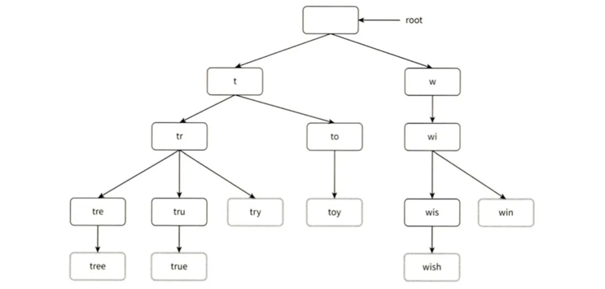
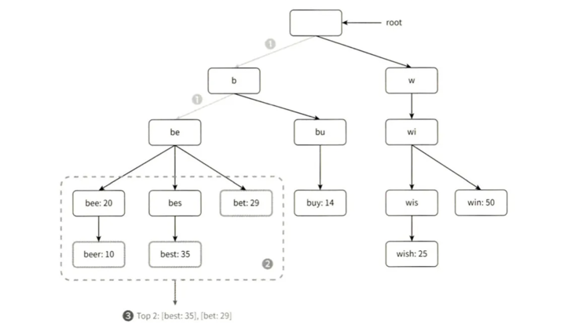
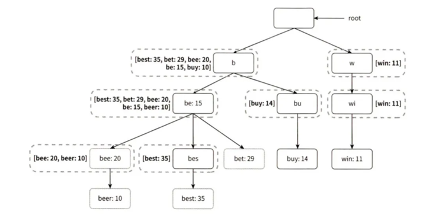
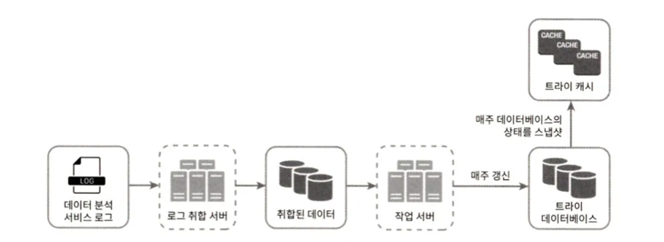

## 1단계 문제 이해 및 설계 범위 확정

### 요구사항

- 빠른 응답 속도 : 응답속도는 100밀리초 이내여야 한다. (by 페이스북)
- 연관성 : 자동완성되어 출력되는 검색어는 사용자가 입력한 단어와 연관된 것이어야 한다.
- 정렬 : 인기도 등의 순위 모델에 의해 정렬되어 있어야 한다.
- 규모 확장성 : 많은 트래픽을 감당할 수 있도록 확장 가능해야 한다.
- 고가용성 : 시스템의 일부에 장애가 발생하거나, 느려지거나, 예상치 못한 네트워크 문제가 생겨도 시스템은 계속 사용 가능해야 한다.

### 개략적 규모 추정

- 일간 능동 사용자(DAU) 천만 명
- 평균적으로 한 사용자는 매일 10건의 검색을 수행
- 평균적으로 20바이트의 데이터를 질의
    - 문자 인코딩 방법으로 ASCII를 사용한다고 가정, 1문자 = 1바이트
    - 질의문은 평균적으로 4개 단어로 이루어지고, 각 단어는 평균적으로 다섯 글자로 구성
    - 질의당 평균 4 * 5 = 20바이트
- 검색창에 글자를 입력할 때마다 백엔드에 요청을 보내고, 평균적으로 1회 검색당 20건의 요청이 백엔드로 전달됨
- 대략 초당 24,000건의 질의(QPS)가 발생(= 10,000,000 사용자 * 10질의/일 * 20자 / 24시간 / 3600초)
- 최대 QPS = QPS * 2 = 대략 48,000
- 질의 가운데 20% 정도는 신규 검색어. 대략 0.4GB 정도(= 10,000,000 사용자 * 10질의/일 * 20자 * 20%). 
  - 매일 0.4GB의 신규 데이터가 시스템에 추가된다.

## 2단계 개략적 설계안 제시 및 동의 구하기

개략적으로 시스템은 두 부분으로 나뉜다.

- 데이터 수집 서비스(data gathering service)
  - 사용자가 입력한 질의를 실시간으로 수집한다. 
  - 데이터가 많다면 바람직하지는 않다.
- 질의 서비스(query service)
  - 주어진 질의에 다섯 개의 인기 검색어를 정렬해 내놓는 서비스이다.

### 데이터 수집 서비스

- 질의문과 사용빈도를 저장하는 빈도 테이블(frequency table)이 있다고 가정한다. 
  - query : 질의문을 저장하는 필드
  - frequency :  질의문이 사용된 빈도를 저장하는 필드
- ‘twitch’, ‘twitter’, ‘twitter’, ‘twillo’ 를 검색하면 각각 빈도 개수가 올라간다.

### 질의 서비스

- 사용자가 “tw”를 검색창에 입력하면 “tob 5” 자동완성 검색어가 표시된다.
- 가장 많이 사용된 5개 검색어(”top 5”)는 아래의 SQL 질의문을 사용해 계산할 수 있다.
- 데이터 양이 적을 때는 나쁘지 않지만, 데이터가 아주 많아지면 데이터베이스가 병목이 될 수 있다.

```SQL
SELECT * FROM frequency_table
WHERE query Like 'prefix%'
ORDER BY frequency DESC
LIMIT 5
```

## 3단계 상세 설계

컴포넌트를 몇 개 골라 상세 설계하고, 최적화 방안을 논의한다.

- 트라이(trie) 자료구조
- 데이터 수집 서비스
- 질의 서비스
- 규모 확장이 가능한 저장소
- 트라이 연산

### 트라이 자료구조

- [2][3] 참고
- SQL 질의문은 한계가 있어 트라이 자료구조를 사용할 것이다.
- 트라이 자료구조 설명
  - 트라이는 트리 형태의 자료구조다.
  - 루트 노드는 빈 문자열을 나타낸다.
  - 각 노드는 글자 하나를 저장하며, 26개의 자식 노드(알파벳)를 가질 수 있다.
  - 각 트리 노드는 하나의 단어, 또는 접두어 문자열(prefix string)을 나타낸다.
- 이용 빈도에 따라 정렬된 결과를 내놓기 위해서 각 노드에 빈도 정보까지 저장해야 한다.



- 용어 정리
  - p : 접두어(prefix)의 길이
  - n : 트라이 안에 있는 노드 개수
  - c : 주어진 노드의 자식 노드 개수


- 가장 많이 사용된 질의어 k개는 다음과 같이 찾는다.
  - 해당 접두어를 표현하는 노드를 찾는다. 시간 복잡도 O(p).
  - 해당 노드부터 시작하는 하위 트리를 탐색하여 모든 유효 노드(유효한 검색 문자열을 구성)를 찾는다. 시간 복잡도는 O(c)
  - 유효 노드들을 정렬하여 가장 인기 있는 검색어 k개를 찾는다. 시간 복잡도는 O(clogc).


- 시간 복잡도
    - O(p) + O(c) + O(clogc)


- 예를 들어 k=2 이고 사용자가 검색창에 ‘be’을 입력했다.

  1. 접두어 노드 ‘be’를 찾는다.
  2. 해당 노드부터 시작하는 하위 트리를 탐색하여 모든 유효 노드를 찾는다. [beer: 10], [best:35], [bet: 29] 가 유효 노드다.
  3. 유효 노드를 정렬하여 2개만 골라낸다. [best: 35], [bet: 29] 가 “tr”에 대해 검색된 2개의 인기 검색어다.


- 최악의 경우에 k개 결과를 얻으려고 전체 트라이를 다 검색해야할 수도 있다. 두 가지 해결 방법이 있다.
  1. 접두어의 최대 길이를 제한
  2. 각 노드에 인기 검색어를 캐시


- 접두어 최대 길이 제한 
  - 사용자가 검색창에 긴 검색어를 입력하는 일은 거의 없다. 
  - 검색어의 최대 길이를 작게 제한하면 “접두어 노드를 찾는” 단계의 시간 복잡도는 O(p)에서 O(작은 상숫값)=O(1)로 바뀔 것이다.


- 노드에 인기 검색어 캐시 
  - 각 노드에 k개의 인기 검색어를(5개~10개) 저장해 두면 전체 트라이를 검색하지 않아도 돼서, 시간복잡도를 낮출 수 있다. 
  - 각 노드 저장 공간이 많이 필요해지는데 빠른 응답시간을 위해서 희생할 만한 가치는 있다.
    


- 접두어 최대 길이 제한 + 노드에 인기 검색어 캐시 적용한 후 시간 복잡도
  1. 접두어 노드를 찾는 시간 복잡도는 O(1).
  2. 최고 인기 검색어 5개를 찾는 질의의 시간 복잡도도 O(1). 검색 결과가 이미 캐시되어 있어서다.


### 데이터 수집 서비스

- 지금까지 설계안은 사용자가 검색창에 타이핑할 때마다 실시간으로 데이터를 수정했다. 두 가지 문제가 있다.
  - 매일 수천만 건의 질의가 입력되고 그때마다 트라이를 갱신하면 질의 서비스는 느려질 것이다.
  - 트라이가 만들어지고 나면 인기 검색어는 자주 바뀌지 않을 것이다.

- 트위터 같은 서비스는 제안되는 검색어를 항상 신선할 필요가 있지만, 구글 검색 같은 애플리케이션이라면 자주 바꿀 이유가 없을 것이다.
- 트라이를 만드는 데 쓰는 데이터는 보통 데이터 분석 서비스나 로깅 서비스로부터 올 것이다.
- 수정버전
  
  - 데이터 분석 서비스 로그
    - 검색창에 입력된 질의에 관한 원본 데이터가 보관된다. 
    - 새로운 데이터를 추가만 된다. (수정 X)
  - 로그 취합 서버 
    - 로그 데이터를 취합한다(aggregation).
    - 트위터 같은 실시간 애플리케이션은 취합 주기를 짧게 가져갈 수도 있을 것이다.
    - 대부분 일주일에 한 번이어도 충분할 것이다. 
  - 취합된 데이터
    - time 필드는 해당 주가 시작한 날짜를 나타낸다. 
    - frequency 필드는 해당 질의가 해당 주에 사용된 횟수의 합이다. 
  - 작업 서버(worker)
    - 주기적으로 비동기적 작업(job)을 실행하는 서버 집합이다.
    - 트라이 자료구조를 만들고 트라이 데이터베이스에 저장한다. 
  - 트라이 캐시 
    - 매주 트라이 데이터베이스의 스냅샷을 떠서 갱신한다.
  - 트라이 데이터베이스 
    - 지속성 저장소다. 
    - 트라이 데이터베이스로 사용할 수 있는 선택지
      1. 문서 저장소 (document store)
         - 새 트라이를 매주 만들 것이므로, 주기적으로 트라이를 직렬화하여 데이터베이스에 저장할 수 있다. 
         - 몽고디비(Mongo DB) [4] 등.
      2. 키-값 저장소
         - 트라이는 아래 로직을 적용하면 해시 테이블 형태로 변환 가능하다[4].
             - 트라이에 보관된 모든 접두어를 해시 테이블 키(6장)로 변환
             - 각 트라이 노드에 보관된 모든 데이터를 해시 테이블 값으로 변환

### 질의 서비스

1. 검색 질의가 로드밸런서로 전송된다.
2. 로드밸런서는 해당 질의를 API 서버로 보낸다.
3. API 서버는 트라이 캐시에서 데이터를 가져와 해당 요청에 대한 자동완성 검색어 제안 응답을 구성한다.
4. 데이터가 트라이 캐시에 없는 경우 데이터를 데이터베이스에서 가져와 캐시에 채운다. 
   - 캐시 미스는 캐시 서버의 메모리가 부족하거나 캐시 서버에 장애가 있어도 발생할 수 있다.

- 질의 서비스 최적화 방안
  - AJAX 요청(request)
    - 페이지를 새로고침 할 필요가 없는 방식이다.
  - 브라우저 캐싱(browser caching)
    - 대부분 애플리케이션의 경우 자동완성 검색어 제안 결과는 짧은 시간 안에 자주 바뀌지 않는다. 
    - 구글 검색 엔진이 이런 캐시 메커니즘을 사용한다. (1시간 캐싱)
    - 관련 헤더
      - cache-control 헤더의 private 는 해당 응답이 요청을 보낸 사용자의 캐시에만 보관될 수 있으며 공용 캐시에 저장되어서는 안 된다는 뜻이다. 
      - max-age = 3600 은 해당 캐시 항목은 3600초, 즉 한 시간 동안만 유효하다는 뜻이다.
  - 데이터 샘플링(data sampling)
    - 모든 질의 결과를 로깅하도록 해 놓으면 CPU 자원과 저장공간을 엄청나게 소진하게 된다. 
    - N개 요청 가운데 1개만 로깅하도록 하는 것이다.

### 트라이 연산

- 트라이 생성 
  - 트라이 생성은 작업 서버가 담당하며, 데이터 분석 서비스의 로그나 데이터베이스로부터 취합된 데이터를 이용한다.

- 트라이 갱신 (2가지 방법)
  1. 매주 한 번 갱신하는 방법. 새로운 트라이를 만든 다음에 기존 트라이를 대체한다.
  2. 트라이의 각 노드를 개별적으로 갱신하는 방법. 
     - 성능이 좋지 않다. 
     - 트라이가 작을 때는 고려해볼 수 있다.
     - 트라이 노드를 갱신할 때 모든 상위 노드에도 인기 검색어 질의 결과가 보관되기 때문에, 상위 노드들에 기록된 이용 빈도 수치도 전부 갱신해야 한다.

- 검색어 삭제 
  - 혐오성이 짙거나, 폭력적이거나, 성적으로 노골적이거나, 여러 가지로 위험한 질의어를 자동완성 결과에서 제거해야 한다.
  - 트라이 캐시 앞에 필터 계층(filter layer)를 두고 필터 규칙을 적용한다. 
  - 데이터베이스에서 물리적으로 삭제하는 것은 다음번 업데이트 사이클에 비동기적으로 진행하면 된다.

### 저장소 규모 확장

- 영어 기준 첫 글자를 기준으로 샤딩하는 방법
  - 예를 들어
    - ‘a’부터 ‘m’까지 글자로 시작하는 검색어는 첫 번째 서버에 저장하고, 나머지는 두 번째 서버에 저장한다.
    - 세 대 서버가 필요하다면 ‘a’부터 ‘i’까지는 첫 번째, ‘j’부터 ‘r‘까지는 두 번째, 나머지는 세 번째 서버에 저장한다. 
  - 이 방법을 쓰는 경우 가능한 서버는 최대 26대로 제한된다(알파벳 26자). 
  - 이 이상으로 서버 대수를 늘리려면 샤딩을 계층적으로 해야 한다.
    - 예를 들어 ‘a’로 시작하는 검색어를 네 대 서버에 나눠 보관할 때
    - ‘aa’부터 ‘ag’까지는 첫 번째 서버, ‘ah’부터 ‘an’까지는 두 번째 서버, ‘ao’부터 ‘au’까지는 세 번째 서버에, 나머지는 네 번째 서버에 보관한다.
    - 그럴싸해 보이지만 ‘c’로 시작하는 단어가 ‘x’로 시작하는 단어보다 많아, **균등하게 배분하기가 불가능하다.**

- 과거 질의 데이터의 패턴을 분석하여 샤딩하는 방법
  - 검색어 대응 샤드 관리자(shard map manager)는 어떤 검색어가 어느 저장소 서버에 저장되는지에 대한 정보를 관리한다.
  - 예를 들어 ‘s’로 시작하는 검색어의 양이 ‘u’, ‘v’, ‘w’, ‘x’, ‘y’, ‘z’ 로 시작하는 검색어를 전부 합친 것과 비슷하다면 ‘s’에 대한 샤드 하나와 ‘u’부터 ‘z’까지의 검색어를 위한 샤드 하나를 둔다.

## 4단계 마무리

추가적으로 볼 만한 부분
- 다국어 지원이 가능하도록 시스템을 확장하려면?
  - 트라이에 유니코드(unicode) 데이터를 저장해야 한다. 
  - 유니코드는 “고금을 막론하고 세상에 존재하는 모든 문자 체계를 지원하는 표준 인코딩 시스템”이다[5].
- 국가별로 인기 검색어 순위가 다르다면?
  - 국가별로 다른 트라이를 사용한다. 
  - 트라이를 CDN에 저장하여 응답속도를 높일 수도 있다.
- 실시간으로 변하는 검색어의 추이를 반영하려면? 
  - 특정 검색어의 인기가 갑자기 높아진다면 현 설계안은 지원하기 어렵다. 
    - 작업 서버가 매주 한 번씩만 돌도록 되어 있어 시의 적절하게 트라이를 갱신할 수 없다.
    - 때맞춰 서버가 실행되어도, 트라이를 구성하는 데 너무 많은 시간이 소요된다. 
  - 도움될 몇 가지 아이디어는 다음과 같다.
    - 샤딩을 통하여 작업 대상 데이터의 양을 줄인다.
    - 순위 모델을 바꾸어 최근 검색어에 보다 높은 가중치를 준다.
    - 데이터가 스트림 형태로 올 수 있다, 즉 한번에 모든 데이터를 동시에 사용할 수 없을 수 있다. 
      - 데이터가 스트리밍 된다는 것은 데이터가 지속적으로 생성된다는 뜻이다. 
      - 스트림 프로세싱에는 특별한 종류의 시스템이 필요하다. 
        - 아파치 하둡 맵리듀스(Apache Hadoop MapReduce[6])
        - 아파치 스파크 스트리밍(Apache Spark Streaming[7])
        - 아파치 스톰(Apache Storm[8])
        - 아파치 카프카(Apache Kafka[9]) 등