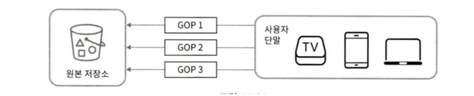

### 유튜브 통계자료

- 월간 능동 사용자 수 : 20 억(2billion)
- 매일 재생되는 비디오 수 : 50 억(5billion)
- 미국 성인 가운데 73% 가 유튜브 이용
- 5천만(50million) 명의 창작자
- 유튜브의 광고 수입은 2019년 기준으로 150억(15.1billion) 달러이며 이는 2018년도 대비 36%가 증가한 수치
- 모바일 인터넷 트래픽 가운데 37% 를 유튜브가 점유
- 80개 언어로 이용 가능

## 1단계 문제 이해 및 설계 범위 확정

### 설계 범위
- 빠른 비디오 업로드
- 원활한 비디오 재생
- 재생 품질 선택 기능
- 낮은 인프라 비용
- 높은 가용성과 규모 확장성, 그리고 안정성
- 지원 클라이언트 : 모바일 앱, 웹브라우저, 스마트 TV

### 개략적 규모 추정

- 일간 능동 사용자(DAU: Daily Active User) 수는 5백만(5million)
- 한 사용자는 하루에 평균 5개의 비디오를 시청
- 10%의 사용자가 하루에 1 비디오 업로드
- 비디오 평균 크기는 300MB
- 비디오 저장을 위해 매일 새로 요구되는 저장 용량 = 5백만 * 10% * 300MB = 150TB
- CDN 비용
  - 클라우드 CDN을 사용할 경우 나가는 데이터의 양에 따라 과금한다.
  - 아마존의 클라우드프론트(CloudFront)[3]를 사용할 경우, 100% 트래픽이 미국에서 발생한다고 가정하면 1GB당 $0.02의 요금이 발생한다.
  - 비디오 스트리밍 비용만 따졌을 때, 매일 발생하는 요금 5백만 * 5비디오 * 0.3GB * $0.02 = $150,000

## 2단계 개략적 설계안 제시 및 동의 구하기

- CDN과 BLOB 스토리지의 경우 기존 클라우드 서비스를 활용한다. 
  - 규모 확장이 쉬운 BLOB 저장소나 CDN 를 만드는 것은 복잡하고 많은 비용이 든다. 
  - 넷플릭스는 아마존의 클라우드 서비스[4], 페이스북은 아카마이(Akamai)의 CDN을 이용한다.

- 개략적으로 시스템은 다음 세 개 컴포넌트로 구성된다.
  - 단말(client) : 컴퓨터, 모바일 폰, 스마트 TV
  - CDN : 비디오는 CDN에 저장한다. 재생 버튼을 누르면 CDN으로부터 스트리밍이 이루어진다.
  - API 서버 : 비디오 스트리밍을 제외한 모든 요청은 API 서버가 처리한다. 
    - 피드 추천, 비디오 업로드 URL 생성, 메타데이터 데이터베이스와 캐시 갱신, 사용자 가입 등등

### 비디오 업로드 절차

- API 서버
  - 비디오 스트리밍을 제외한 다른 모든 요청을 처리한다.
- 메타데이터 데이터베이스
  - 비디오의 메타데이터를 보관한다. 
  - 샤딩과 다중화를 적용하여 성능 및 가용성을 충족한다.
- 메타데이터 캐시
  - 성능을 높이기 위해 비디오 메타데이터와 사용자 객체는 캐시한다.
- 원본 저장소
  - 원본 비디오를 보관할 대형 이진 파일 저장소 (BLOB, 즉 Binary Large Object storage) 시스템이다. 
  - ([6])BLOB 저장소는 “이진 데이터를 하나의 개체로 보관하는 데이터베이스 관리 시스템”이다.
- 트랜스코딩 서버
  - 비디오 인코딩로, 비디오의 포맷(MPEG, HLS 등)을 변환한다. 
  - 단말이나 대역폭 요구사항에 맞는 최적의 비디오 스트림을 제공하기 위해 필요하다.
- 트랜스코딩 비디오 저장소
  - 트랜스코딩이 완료된 비디오를 저장하는 BLOB 저장소다.
- CDN
  - 비디오를 캐시한다. 사용자가 재생 버튼을 누르면 비디오 스트리밍은 CDN을 통해 이루어진다.
- 트랜스코딩 완료 큐
  - 비디오 트랜스코딩 완료 이벤트를 보관한다.
- 트랜스코딩 완료 핸들러
  - 트랜스코딩 완료 큐에서 이벤트 데이터를 꺼내어 메타데이터 캐시와 데이터베이스를 갱신할 작업 서버들이다.

**비디오 업로드 시 병렬적으로 수행되는 두 프로세스**

1. 비디오 업로드.
2. 비디오 메타데이터 갱신. 메타데이터에는 비디오 URL, 크기, 해상도, 포맷, 사용자 정보가 포함된다.

**프로세스 a: 비디오 업로드**

1. 비디오를 원본 저장소에 업로드한다.
2. 트랜스코딩 서버는 원본 저장소에서 해당 비디오를 가져와 트랜스코딩을 시작한다.
3. 트랜스코딩이 완료되면 아래 두 절차가 병렬적으로 수행된다. 
   - 3a. 완료된 비디오를 트랜스코딩 비디오 저장소로 업로드한다.
   - 3b. 트랜스코딩 완료 이벤트를 트랜스코딩 완료 큐에 넣는다. 
     - 3a.1. 트랜스코딩이 끝난 비디오를 CDN에 올린다.
     - 3b.1 완료 핸들러가 이벤트 데이터를 큐에서 꺼낸다.
     - 3b.1.a, 3b.1.b 완료 핸들러가 메타데이터의 데이터베이스와 캐시를 갱신한다.
4. API 서버가 단말에게 비디오 업로드가 끝나서 스트리밍 준비가 되었음을 알린다.

**프로세스 b: 메타데이터 갱신**

- 원본 저장소에 파일이 업로드 되는 동안, 단말은 병렬적으로 비디오 메타데이터(파일 이름, 크기, 포맷 등의 정보) 갱신 요청을 API 서버에 보낸다. 
- API 서버는 이 정보로 메타데이터 캐시와 데이터베이스를 업데이트한다.

### 비디오 스트리밍 절차

- 다운로드와 스트리밍의 차이
  - 다운로드는 비디오를 단말로 내려 받는 것
  - 스트리밍은 사용자 장치가 원격지의 비디오로부터 지속적으로 비디오 스트림을 전송 받아 영상을 재생하는 것

- 먼저 스트리밍 프로토콜(streaming protocal)을 알아야 한다. 
  - 스트리밍 프로토콜은 비디오 스트리밍을 위해 데이터를 전송할 때 쓰이는 표준화된 통신방법이다. 
  - 널리 사용되는 스트리밍 프로토콜로 종류
    - MPEG-DASH.
    - 애플 HLS.
    - 마이크로소프트 스무드 스트리밍(Microsoft Smooth Streamin).
    - 어도비 HTTP 동적 스트리밍(Adobe HTTP Dynamic Streaming, HDS).

- 프로토콜마다 지원하는 비디오 인코딩이 다르고 플레이어도 다르다([7]). 
- 비디오는 CDN에서 바로 스트리밍된다. 사용자의 단말에 가장 가까운 CDN 엣지 서버(edge server)가 비디오 전송을 담당하며, 전송지연은 아주 낮다.

## 3단계 상세 설계

### 비디오 트랜스코딩

- 비디오를 녹화하면 단말(전화, 카메라)은 해당 비디오를 특정 포맷으로 저장한다. 
  - 이 비디오가 다른 단말에서도 재생되려면 다른 단말과 호환되는 비트레이트(bitrate)와 포맷으로 저장되어야 한다.
  - 비트레이트는 비디오를 구성하는 비트가 얼마나 빨리 처리되어야 하는지를 나타내는 단위다. 
  - 비트레이트가 높은 비디오는 일반적으로 고화질 비디오다. 
  - 비트레이트가 높은 비디오 스트림을 정상 재생하려면 보다 높은 성능의 컴퓨팅 파워가 필요하고, 인터넷 회선 속도도 빨라야 한다.

- 비디오 트랜스코딩이 중요한 이유
  - 가공되지 않은 원본 비디오(raw video)는 저장 공간을 많이 차지한다. 
  - 상당수의 단말과 브라우저는 특정 종류의 비디오 포맷만 지원하기 때문에, 호환성을 위해 하나의 비디오를 여러 포맷으로 인코딩해 두는 것이 좋다.
  - 사용자의 네트워크 대역폭에 따라 저화질 비디오 또는 고화질 비디오를 보내야 한다.
  - 네트워크 상황이 수시로 달라질 수 있기 때문에 비디오 화질을 자동으로 변경하거나 수동으로 변경할 수 있도록 하는 것이 좋다.

- 인코딩 포맷 구성
  - 컨테이너(container)
    - 비디오 파일, 오디오 코덱, 메타데이터, 자막 등을 담는 바구니다.
    - 컨테이너 포맷은 .avi, mov, mp4 같은 파일 확장자를 보면 알 수 있다.
  - 코덱(codec)
    - 비디오 화질은 보존하면서 파일 크기를 줄일 목적으로 고안된 압축 및 압축 해제 알고리즘이다. 
    - 가장 많이 사용되는 비디오 코덱으로 H.264, VP9, HEVC가 있다.

### 유향 비순환 그래프(DAG: Directed Acyclic Graph) 모델

- DAG 모델이 필요한 이유
  - 콘텐츠 창작자는 각자 자기만의 비디오 프로세싱 요구사항을 갖고 있다.
    - 비디오 위에 워터마크(watermark), 섬네일 등
  - 각기 다른 유형의 비디오 프로세싱 파이프라인을 지원하고 병렬성을 높이기 위해, 추상화를 도입하여 클라이언트 프로그래머가 실행할 작업(task)를 정의할 수 있도록 해야 한다.
    - 예를 들어 페이스북의 스트리밍 비디오 엔진은 DAG 모델을 도입, 작업을 단계별로 배열할 수 있도록 하여 해당 작업들이 순차적으로 또는 병렬적으로 실행될 수 있도록 하고 있다[8].

- 원본 비디오는 비디오, 오디오, 메타데이터 세 부분으로 나뉘어 처리된다.
  - 비디오 부분에 적용되는 작업
    - 검사(inspection) : 좋은 품질의 비디오인지, 손상은 없는지 확인
    - 비디오 인코딩(video encoding) : 비디오를 다양한 해상도, 코덱, 비트레이트 조합으로 인코딩
    - 섬네일(thumbnail) : 사용자가 업로드한 이미지나 비디오에서 자동 추출된 이미지로 섬네일 생성
    - 워터마크(watermark) : 비디오에 대한 식별정보를 이미지 위에 오버레이 형태로 띄워 표시

### 비디오 트랜스코딩 아키텍처

- 이 아키텍처가 동작한 결과로 인코딩된 비디오가 만들어진다.

- 컴포넌트
  - 전처리기(preprocessor)
  - DAG 스케줄러
  - 자원 관리자(resource manager)
  - 작업 실행 서버(resource worker)
  - 임시 저장소(temporary storage).

- 컴포넌트 설명 
  - 전처리기
    1. 비디오 분할(video splitting)
       - 비디오 스트림을 GOP(Group of Pictures)라고 불리는 단위로 쪼갠다. 
       - GOP 는 특정 순서로 배열된 프레임(frame) 그룹이다. 
       - 하나의 GOP는 독립적으로 재생 가능하며, 길이는 몇 초 정도다. 
       - 오래된 단말이나 브라우저는 GOP 단위의 비디오 분할을 지원하지 않는다. 
       - 그런 단말은 전처리기가 비디오 분할을 대신 한다.
    2. DAG 생성
       - 클라이언트 프로그래머가 작성한 설정 파일로 DAG를 만든다.
       - 사례 : 다운로드 -> 트랜스코딩
    3. 데이터 캐시
       - 전처리기는 분할된 비디오의 캐시이기도 하다. 
       - 안정성을 높이기 위해 전처리기는 GOP와 메타데이터를 임시 저장소에 보관한다. 
       - 비디오 인코딩이 실패하면 시스템은 보관된 데이터로 인코딩을 재개한다. 

  - DAG 스케줄러 
    - DAG 스케줄러는 DAG 그래프를 몇 개 단계(stage)로 분할한 다음에 그 각각을 자원 관리자의 작업 큐에 집어넣는다. 
    - 동작 사례
      
      1. 첫 번째 단계에서 비디오, 오디오, 메타데이터를 분리한다.
      2. 두 번째 단계에서 해당 비디오 파일 인코딩, 섬네일 추출, 오디오 파일 인코딩을 한다. 

  - 자원 관리자 
    - 자원 배분을 효과적으로 수행. 세 개의 큐 + 작업 스케줄러.
    
    - 작업 관리자 동작
      - 작업 관리자는 작업 큐에서 가장 높은 우선순위의 작업을 꺼낸다.
      - 작업 관리자는 해당 작업을 실행하기 적합한 작업 서버를 고른다.
      - 작업 스케줄러는 해당 작업 서버에게 작업 실행을 지시한다.
      - 작업 스케줄러는 해당 작업이 어떤 서버에게 할당되었는지에 관한 정보를 실행 큐에 넣는다.
      - 작업 스케줄러는 작업이 완료되면 해당 작업을 실행 큐에서 제거한다. 
  - 작업 서버 
    - 작업 서버는 DAG에 정의된 작업을 수행한다. 
    - 작업 종류에 따라 작업 서버도 구분한다. (워터마크, 인코딩 등)
  - 임시 저장소 
    - 임시 저장소는 여러 저장소 시스템을 사용할 수 있다. 
    - 저장할 데이터의 유형, 크기, 이용 빈도, 데이터 유효기간 등에 따라 선택한다. 
      - 예를 들어 
      - 메타데이터는 작업 서버가 자주 참조하고 보통 크기도 작음 -> 메모리에 캐시 
      - 비디오/오디오 데이터 -> BLOB 저장
    - 임시 저장소에 보관한 데이터는 비디오 프로세싱이 완료되면 삭제한다. 
  - 인코딩된 비디오 
    - 인코딩 파이프라인의 최종 결과물. 
    - funny_720p.mp4 같은 이름을 갖는다.

### 시스템 최적화

- **속도 최적화: 비디오 병렬 업로드** 
  - 비디오 전부를 한 번의 업로드로 올리는 것은 비효율적이다. 
  - 하나의 비디오를 작은 GOP들로 분할할 수 있다.
    
  - 분할한 GOP를 병렬적으로 업로드하면 일부가 실패해도 빠르게 업로드를 재개할 수 있다. 
  - 업로드 속도를 높일 수 있다.
    

- **속도 최적화 : 업로드 센터를 사용자 근거리에 지정** 
  - 미국 거주자는 비디오를 북미 지역 업로드 센터로, 중국 사용자는 아시아 업로드 센터로 보낸다.
  - 이를 위해 본 설계안은 CDN을 업로드 센터로 이용한다.

- **속도 최적화 : 모든 절차를 병렬화**
  - as-is
    - 비디오를 원본 저장소에서 CDN 으로 옮길 때, 어떤 단계의 결과물은 이전 단계의 결과물을 입력으로 사용하여 만들어진다. 
      
  - to-be
    - 결합도를 낮추기 위해 메시지 큐를 도입한다.
    - 메시지 큐를 도입하여 인코딩 모듈은 다운로드 모듈의 작업이 끝나기를 더 이상 기다릴 필요가 없다. 
    - 메시지 큐에 보관된 이벤트 각각을 인코딩 모듈은 병렬적으로 처리할 수 있다.
      

- **안정성 최적화 : 미리 사인된 업로드 URL**
  - 허가받은(authorized) 사용자만이 비디오를 업로드할 수 있도록 하기 위해, 미리 사인된(pre-signed, S3 용어) 업로드 URL을 이용한다. 
  - 업로드 절차 (to-be)
    1. 클라이언트는 HTTP 서버에 POST 요청으로 미리 사인된 URL을 받는다. 
       - 해당 URL이 가리키는 객체(object)에 대한 접근 권한이 이미 주어져 있는 상태다.
    2. API 서버는 미리 사인된 URL을 돌려준다.
    3. 클라이언트는 해당 URL이 가라키는 위치에 비디오를 업로드한다.

- **안정성 최적화 : 비디오 보호**
  - 비디오의 저작권 보호를 위한 세가지 선택지
    - 디지털 저작권 관리(DRM: Digital Rights Management) 시스템 도입.
    - AES 암호화 : 비디오를 암호화하고 접근 권한을 설정하는 방식. 암호화된 비디오는 재생 시에만 복호화, 허락된 사용자만 암호화된 비디오를 시청.
    - 워터마크 : 비디오 위에 소유자 정보를 포함하는 이미지 오버레이를 올린다.

- **비용 최적화**
  - CDN은 비싸다. 데이터 크기가 크면 클수록 더하다. 
  - 유튜브의 비디오 스트리밍은 롱테일(long-tail) 분포를 따른다[11][12]. 
  - 인기 있는 비디오는 자주 재생되지만, 나머지는 거의 보는 사람이 없다.
  - 최적화 방법
    1. 인기 비디오는 CDN을 통해 재생하고 다른 비디오는 비디오 서버를 통해 재생한다.
      
    2. 인기가 별로 없는 비디오는 인코딩 하지 않는다. 짧은 비디오라면 필요할 때 인코딩하여 재생한다.
    2. 어떤 비디오는 특정 지역에서만 인기가 높아 다른 지역에 옮길 필요가 없다.
    3. 인터넷 사용 비용을 낮추기 위해 CDN을 직접 구축하고 인터넷 서비스 제공자(ISP: Internet Service Provider)와 제휴한다. 
  - 이 최적화는 콘텐츠 인기도, 이용 패턴, 비디오 크기 등의 데이터에 근거한 것이다. 최적화를 시도하기 전에 시청 패턴을 분석해야 한다. ([12][13])

### 오류 처리
- 장애를 잘 감내하는(high fault-tolerant) 시스템을 위해 오류를 우아하게 처리하고 빠르게 회복해야 한다.

- 시스템 오류에 종류
  - 회복 가능 오류(recoverable error)
    - 특정 비디오 세그먼트를 트랜스코딩하다 실패하는 등의 오류.
    - 일반적으로 이런 오류는 몇 번 재시도(retry)하면 된다. 
    - 하지만 계속해서 실패하고 복구가 어렵다면 클라이언트에게 적절한 오류 코드를 반환해야 한다.
  - 회복 불가능 오류(non-recoverable error)
    - 비디오 포맷이 잘못된 등의 오류.
    - 시스템은 해당 비디오에 대한 작업을 중단하고 클라이언트에게 적절한 오류 코드를 반환해야 한다.

- 시스템 컴포넌트 각각에 발생할 수 있는 오류에 대한 전형적 해결 방법 요약
  - 업로드 오류 : 몇번 재시도한다.
  - 비디오 분할 오류 : 낡은 버전의 클라이언트가 GOP 경계에 따라 비디오를 분할하지 못하면 전체 비디오를 서버로 전송하고 서버가 해당 비디오 분할을 처리한다.
  - 트랜스코딩 오류 : 재시도한다.
  - 전처리 오류 : DAG 그래프를 재생성한다.
  - DAG 스케줄러 오류 : 작업을 다시 스케줄링한다.
  - 자원 관리자 큐에 장애 발생 : 사본(replica)을 이용한다.
  - 작업 서버 장애 : 다른 서버에서 해당 작업을 재시도한다.
  - API 서버 장애 : 신규 요청을 다른 API 서버로 보낸다.
  - 메타데이터 캐시 서버 장애
    - 데이터는 다중화되어 있으므로 다른 노드에서 데이터를 가져온다. 
    - 장애가 난 캐시 서버는 새로운 것으로 교체한다.
  - 메타데이터 데이터베이스 서버 장애
    - 주 서버가 죽었다면 부 서버 가운데 하나를 주 서버로 교체한다.
    - 부 서버가 죽었다면 다른 부 서버를 통해 읽기 연산을 처리하고 죽은 서버는 새것으로 교체한다.

  
## 4단계 마무리

추가로 면접관과 논의할만한 부분

- API 계층의 규모 확장성 확보 방안
  - API 서버는 무상태 서버이므로 수평적 규모 확장이 가능
- 데이터베이스 계층의 규모 확장성 확보 방안
  - 데이터베이스의 다중화와 샤딩 방법
- 라이브 스트리밍(live streaming)
  - 라이브 스트리밍은 비디오를 실시간으로 녹화하고 방송하는 절차이다. 
  - 라이브 스트리밍은 응답지연이 좀 더 낮아야 한다. 스트리밍 프로토콜 선정에 유의해야 한다.
  - 라이브 스트리밍은 병렬화 필요성이 떨어진다. 작은 단위의 데이터를 실시간으로 빨리 처리해야 하기 때문이다.
  - 라이브 스트리밍 오류 시 너무 많은 시간이 걸리는 방안은 사용하기 어렵다.
- 비디오 삭제(takedown)
  - 저작권을 위반한 비디오, 선정적 비디오, 불법적 행위에 관계된 비디오는 내려야 한다. 
  - 업로드 과정에서 식별하거나 사용자의 신고 절차를 통해 판별한다.