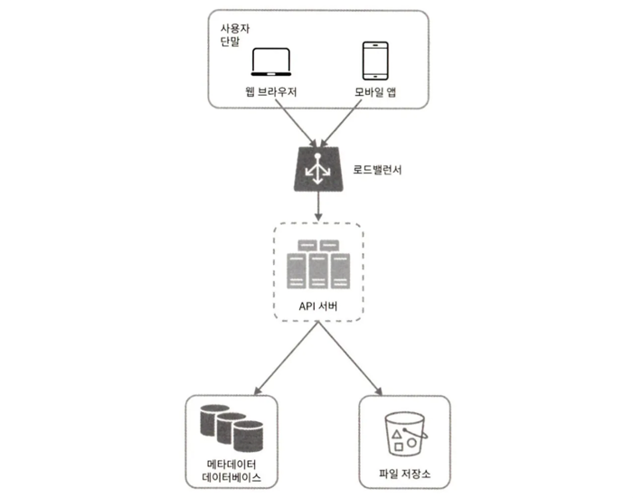
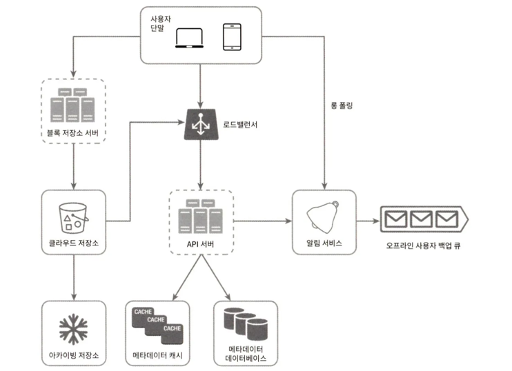
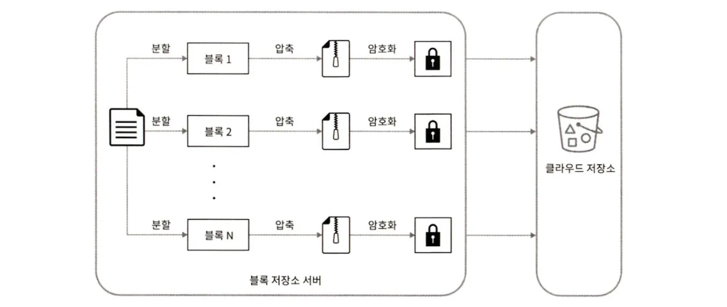
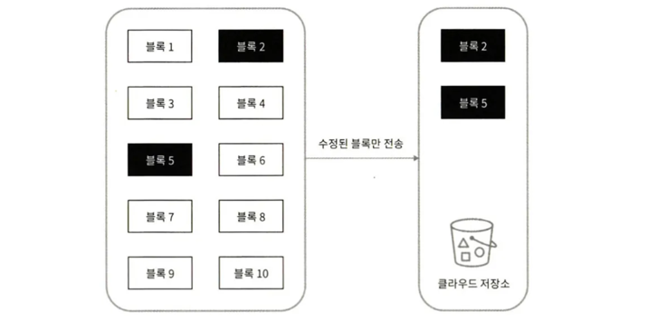

## 1단계 문제 이해 및 설계 범위 확정

- 기능적 요구사항
  - 파일 추가.
  - 파일 다운로드.
  - 여러 단말에 파일 동기화. 한 단말에서 파일을 추가하면 다른 단말에도 자동으로 동기화.
  - 파일 갱신 이력 조회(revision history).
  - 파일 공유.
  - 파일이 편집되거나 삭제되거나 새롭게 공유되었을 때 알림 표시.

- 비-기능적 요구사항
  - 안정성 : 데이터 손실은 발생하면 안 된다.
  - 빠른 동기화 속도
  - 네트워크 대역폭 : 네트워크 대역폭을 불필요하게 많이 소모하면 사용자는 좋아하지 않을 것이다.
  - 규모 확장성 : 아주 많은 양의 트래픽도 처리 가능해야 한다.
  - 높은 가용성 : 일부 서버에 장애가 발생하거나, 느려지거나, 네트워크 일부가 끊겨도 시스템은 계속 사용 가능해야 한다.

### 개략적 추정치

- 가입 사용자는 오천만 명이고 천만 명의 DAU 사용자가 있다고 가정
- 모든 사용자에게 10GB의 무료 저장공간 할당
- 매일 각 사용자가 평균 2개의 파일을 업로드한다고 가정. 각 파일의 평균 크기는 500KB
- 읽기:쓰기 비율은 1:1
- 필요한 저장공간 총량=5천만 사용자*10GB = 500페타바이트
- 업로드 API QPS = 1천만 사용자 * 2회 업로드 / 24시간 / 3600초 = 약 240
- 최대 QPS = QPS * 2 = 480

## 2단계 개략적 설계안 제시 및 동의 구하기

- 모든 것을 담은 한 대 서버에서 출발해 점진적으로 천만 사용자 지원이 가능한 시스템으로 발전시켜 나갈 것이다.

- 구성
  - 파일을 올리고 다운로드 하는 과정을 처리할 웹 서버
  - 사용자 데이터, 로그인 정보, 파일 정보 등의 메타데이터를 보관할 데이터베이스
  - 파일을 저장할 저장소 시스템. 파일 저장을 위해 1TB의 공간을 사용할 것이다.

    
- 기본적인 API 3가지
  1. 파일 업로드 API
     - 단순 업로드
       - 파일 크기가 작을 때 사용한다.
     - 이어 올리기(resumable upload)
       - 파일 사이즈가 크고 네트워크 문제로 업로드가 중단될 가능성이 높다고 생각되면 사용한다.
       - 이어 올리기 세 단계 절차 ([2])
           - 이어 올리기 URL을 받기 위한 최초 요청 전송
           - 데이터를 업로드하고 업로드 상태 모니터링
           - 업로드에 장애가 발생하면 장애 발생시점부터 업로드를 재시작
  2. 파일 다운로드 API
     - 파일 다운로드 API 예
         - https://api.example.com/files/download
         - 인자
           - path : 다운로드할 파일의 경로
           - { “path”: “/recipes/soup/best_soup.txt” }

  3. 파일 갱신 히스토리 API
     - 파일 갱신 히스토리 API 예
         - https://api.example.com/files/list_revisions
         - 인자
             - path: 갱신 히스토리를 가져올 파일의 경로
             - limit : 히스토리 길이의 최대치 
             - {  “path”: “/recipes/soup/best_soup.txt”, “limit”: 20  }

### 한 대 서버의 제약 극복

- 로드밸런서
  - 네트워크 트래픽 분산 또는 장애 시 서버 우회를 위해 사용한다. 
- 웹 서버
  - 수평확장
- 메타데이터 데이터베이스
  - 데이터베이스를 파일 저장 서버에서 분리하여 SPOF(Single Point of Failure)를 회피한다. 
  - 다중화, 샤딩으로 가용성과 규모 확장성에 대응한다.
- 파일 저장소
  - S3를 파일 저장소로 사용하고 가용성과 데이터 무손실을 보장하기 위해 두 개 이상의 지역에 데이터를 다중화한다.

### 동기화 충돌

- 동기화 충돌은 두 명 이상의 사용자가 같은 파일이나 폴더를 동시에 업데이트하려고 하는 경우다.
- 먼저 처리되는 변경은 성공한 것으로 보고, 나중에 처리되는 변경은 충돌이 발생한 것으로 표시하는 방법을 사용한다. 
  - 충돌 발생 시 사용자는 두 파일을 하나로 합칠지 아니면 둘 중 하나를 다른 파일로 대체할지를 결정해야 한다. ([4][5])

### 개략적 설계안

- 블록 저장소 서버(block server)
  - 파일 블록을 클라우드 저장소에 업로드하는 서버다. 
  - 파일을 여러 개의 블록으로 나눠 S3에 저장하며, 각 블록에는 할당된 고유한 해시값은 메타데이터 데이터베이스에 저장한다.
  - 각 블록은 독립적인 객체다. 파일을 재구성하려면 블록들을 원래 순서대로 합쳐야 한다. 
- 클라우드 저장소
  - 파일은 블록 단위로 나눠져 클라우드 저장소에 보관된다.
- 아카이빙 저장소(cold storage) 
  - 오랫동안 사용되지 않은 비활성화(inactive) 데이터를 저장한다.
- API 서버
  - 파일 업로드 외에 거의 모든 것을 담당한다. 
  - 사용자 인증, 사용자 프로파일 관리, 파일 메타데이터 갱신 등에 사용된다.
- 메타데이터 데이터베이스
  - 사용자, 파일, 블록, 버전 등의 메타데이터 정보를 관리한다. 
  - 실제 파일은 클라우드에 보관, 데이터베이스에는 오직 메타데이터만 둔다.
- 메타데이터 캐시
  - 성능을 높이기 위해 자주 쓰이는 메타데이터는 캐시한다.
- 알림 서비스
  - 특정 이벤트가 발생했음을 클라이언트에게 알리는데 쓰이는 발생/구독 프로토콜 기반 시스템이다. 
  - 예시 설계안의 경우에는 파일 추가, 편집, 삭제 등을 알리고 파일의 최신 상태를 확인하도록 하는 데 쓰인다.
- 오프라인 사용자 백업 큐
  - 클라이언트가 접속 중이 아니라서 파일의 최신 상태를 확인할 수 없을 때 
  - 해당 정보를 이 큐에 두어 나중에 클라이언트가 접속했을 때 동기화될 수 있도록 한다.

## 3단계 상세 설계

### 블록 저장소 서버

- 블록 저장소 서버가 하는 일
  - 파일을 블록 단위로 나누고
  - 각 블록에 압축 알고리즘을 적용 (네트워크 대역폭 절감)
    - 블록 단위로 압축
    - 예를 들어 텍스트 파일을 압축할 때는 gzip 이나 bzip2, 이미지나 비디오를 압축할 때는 다른 압축 알고리즘을 쓴다.
  - 암호화 
  - 수정된 블록만 전송 (델타 동기화) (네트워크 대역폭 절감)
    - 큰 파일들은 업데이트가 일어날 때마다 전체 파일을 서버로 보내면 네트워크 대역폭을 많이 잡아먹게 된다.

- 새 파일이 추가되었을 때 블록 저장소 서버 동작

  - 주어진 파일을 작은 블록들로 분할한다.
  - 각 블록을 압축 알고리즘을 사용해 압축한다.
  - 클라우드 저장소에 보내기 전에 암호화한다.
  - 클라우드 저장소로 보낸다.

- 델타 동기화 전략 동작 방식

  - 검정색으로 표시된 블록 2와 5는 수정된 블록이다.
  - 갱신된 부분만 동기화해야 하므로 이 두 블록만 클라우드 저장소에 업로드한다.

### 높은 일관성 요구사항

- 강한 일관성(strong consistency) 모델을 기본으로 지원해야 한다. 
  - 같은 파일이 단말이나 사용자에 따라 다르게 보이면 안된다. 
  - 메타데이터 캐시와 데이터베이스 계층에도 같은 원칙이 적용돼야 한다. 
  - 관계형 데이터베이스는 ACID(Atomicity, Consistency, Isolation, Durability)를 보장하므로 강한 일관성을 보장하기 쉽다[9].
  - NoSQL 데이터베이스는 기본으로 지원하지 않기 때문에 동기화 로직 안에 프로그램해 넣어야 한다.

- 메모리 캐시는 보통 최종 일관성(eventual consistency) 모델을 지원하기 때문에 강한 일관성을 위해 다음 사항을 보장해야 한다.
  - 캐시에 보관된 사본과 데이터베이스에 있는 원본(master)이 일치한다.
  - 데이터베이스에 보관된 원본에 변경이 발생하면 캐시에 있는 사본을 무효화한다.

### 메타데이터 데이터베이스

- ACID를 기본 지원하는 관계형 데이터베이스를 채택하여 높은 일관성을 달성한다.
- 테이블은 user(1), device(N), namespace(N), file(N), file_version(N), block(N) 등으로 구성한다. 

### 업로드 절차

- 클라이언트 1이 두 개의 요청을 병렬로 보낸다. 
  - 첫 번째 요청은 파일 메타데이터를 추가하기 위한 것이고,
  - 두 번째 요청은 파일을 클라우드 저장소로 업로드하기 위한 것이다. 

- 파일 메타데이터 추가 요청
    1. 새 파일의 메타데이터를 데이터베이스에 저장하고 업로드 상태를 대기중(pending)으로 변경
    2. 새 파일이 추가되었음을 알림 서비스에 통지
    3. 알림 서비스는 관련된 클라이언트(클라이언트 2)에게 파일이 업로드되고 있음을 알림

- 파일을 클라우드 저장소에 업로드 
  - 2.1 클라이언트 1이 파일을 블록 저장소 서버에 업로드 
  - 2.2 블록 저장소 서버가 파일을 블록 단위로 쪼깨고, 압축, 암호화 한 다음에 클라우드 저장소에 전송 
  - 2.3 업로드가 끝나면 클라우드 스토리지는 완료 콜백(callback)을 호출. 이 콜백 호출은 API 서버로 전송됨 
  - 2.4 메타데이터 DB에 기록된 해당 파일의 상태를 완료(uploaded)로 변경 
  - 2.5 알림 서비스에 파일 업로드가 끝났음을 통지 
  - 2.6 알림 서비스는 관련된 클라이언트(클라이언트 2)에게 파일 업로드가 끝났음을 알림

### 다운로드 절차

- 파일이 새로 추가되거나 편집되면 자동으로 파일을 다운로드한다.
- 클라이언트는 다른 클라이언트가 파일을 편집하거나 추가했다는 사실을 어떻게 감지할까?
  1. 클라이언트 A가 접속 중이고 다른 클라이언트가 파일을 변경하면 알림 서비스가 클라이언트 A에게 변경이 발생했으니 새 버전을 끌어가야 한다고 알린다.
  2. 클라이언트 A가 네트워크에 연결된 상태가 아닐 경우에는 데이터는 캐시에 보관되고, 해당 클라이언트의 상태가 접속 중으로 바뀌면 그때 해당 클라이언트가 새 버전을 가져간다.

- 파일이 변경되었음을 감지한 클라이언트는 API 서버를 통해 메타데이터를 새로 가져가고, 블록들을 다운받아 파일을 재구성한다.
  1. 알림 서비스가 클라이언트 2에게 누군가 파일을 변경했음을 알림
  2. 알림을 확인한 클라이언트 2는 새로운 메타데이터를 요청
  3. API 서버는 메타데이터 데이터베이스에게 새 메타데이터 요청
  4. API 서버에게 새 메타데이터가 반환됨
  5. 클라이언트 2에게 새 메타데이터가 반환됨
  6. 클라이언트 2는 새 메타데이터를 받는 즉시 블록 다운로드 요청 전송
  7. 블록 저장소 서버는 클라우드 저장소에서 블록 다운로드
  8. 클라우드 저장소는 블록 서버에 요청된 블록 반환
  9. 블록 저장소 서버는 클라이언트에게 요청된 블록 반환. 클라이언트 2는 전송된 블록을 사용하여 파일 재구성

### 알림 서비스

- 이벤트 데이터를 클라이언트들로 보내는 서비스다.

- 두 가지 방식
  - 롱 폴링(long polling) => 사용
    - 드롭박스가 이 방식을 채택하고 있다[10].
    - 방식
      - 각 클라이언트는 알림 서버와 롱 폴링용 연결을 유지하다가 특정 파일에 대한 변경을 감지하면 해당 연결을 끊는다. 
      - 이때 클라이언트는 메타데이터 서버와 연결해 파일의 최신 내역을 다운로드 해야한다. 
      - 다운로드 작업이 끝났거나 연결 타임아웃 시간에 도달한 경우에는 즉시 새 요청을 보내어 롱 폴링 연결을 복원하고 유지해야 한다.
  - 웹소켓(WebSocket)
    - 양방향 통신이 가능하다. 
    - 채팅 서비스와는 달리 본 시스템은 양방향 통신이 필요하지 않다. 

### 저장소 공간 절약

- 파일 갱신 이력을 보존하고 안정성을 보장하기 위해서 파일의 여러 버전을 여러 데이터센터에 보관할 필요가 있다.

- 비용 절감 세 가지 방법 
  - 중복 제거(de-dupe)
    - 중복된 파일 블록을 계정 차원에서 제거하는 방법이다. 
    - 두 블록이 같은 블록인지는 해시 값을 비교하여 판단한다.
  - 지능적 백업 전략
    - 한도 설정 : 보관해야 하는 파일 버전 개수에 상한을 두고, 상한에 도달하면 제일 오래된 버전은 버린다.
    - 중요한 버전만 보관
      - 어떤 파일은 아주 자주 바뀐다. 
      - 예를 들어 편집 중인 문서가 업데이트될 때마다 새로운 버전으로 관리한다면 짧은 시간 동안 1000개가 넘는 버전이 만들어질 수도 있다. 
      - 그 가운데 중요한 것만 골라내야 한다.
  - 자주 쓰이지 않는 데이터는 아카이빙 저장소(cold storage)로 옮긴다. 
    - 몇달 혹은 수년간 이용되지 않은 데이터를 의미한다. 
    - 아마존 S3 글래시어(glacier) 같은 아카이빙 저장소 이용료는 S3보다 훨씬 저렴하다[11].

### 장애 처리

- 로드밸런서 장애
  - 로드밸런서에 장애가 발생할 경우 부(secondary) 로드밸런서가 활성화되어 트래픽을 이어받아야 한다. 
  - 로드 밸런서끼리 박동(heartbeat) 신호를 주기적으로 보내서 상태를 모니터링한다. 
  - 일정 시간 동안 박동 신호에 응답하지 않은 로드밸런서는 장애가 발생한 것으로 간주한다.
- 블록 저장소 서버 장애
  - 블록 저장소 서버에 장애가 발생하였다면 다른 서버가 미완료 상태 또는 대기 상태인 작업을 이어받아야 한다.
- 클라우드 저장소 장애
  - S3 버킷을 여러 지역에 다중화하고, 한 지역에서 장애가 발생하면 다른 지역에서 파일을 가져온다.
- API 서버 장애
  - 로드밸런서는 API 서버에 장애가 발생하면 트래픽을 해당 서버로 보내지 않음으로써 장애 서버를 격리한다.
- 메타데이터 캐시 장애
  - 메타데이터 캐시 서버도 다중화한다. 
  - 한 노드에 장애가 생겨도 다른 노드에서 데이터를 가져올 수 있다. 
  - 장애가 발생한 서버는 새 서버로 교체한다.
- 메타데이터 데이터베이스 장애
  - 주 데이터베이스 서버 장애 : 부 데이터베이스 서버 가운데 하나를 주 데이터베이스 서버로 바꾸고, 부 데이터베이스 서버를 새로 하나 추가한다.
  - 부 데이터베이스 서버 장애 : 다른 부 데이터베이스 서버가 읽기 연산을 처리하도록 하고 그동안 장애 서버는 새 것으로 교체한다.
- 알림 서비스 장애
  - 접속 중인 모든 사용자가 알림 서버와 롱 폴링 연결을 유지하기 때문에, 알림 서비스는 많은 사용자와 연결을 유지하고 관리해야 한다. 
    - 드롭박스 발표자료에 따르면[6], 한 대의 드롭박스 알림 서비스 서버가 관리하는 연결의 수는 1백만 개가 넘는다. 
    - 한 대의 서버에 장애가 발생하면 백만 명 이상의 사용자가 롱 폴링 연결을 다시 만들어야 한다. 
  - 한 대 서버로 백만 개 이상의 접속을 유지하는 것은 가능하지만, 동시에 백만 개 접속을 ‘시작’하는 것은 불가능하다. 
  - 그래서 롱 폴링 연결을 복구하는 것은 상대적으로 느릴 수 있다.
- 오프라인 사용자 백업 큐 장애
  - 큐 또한 다중화. 
  - 큐에 장애가 발생하면 구독 중인 클라이언트들은 백업 큐로 구독 관계를 재설정해야 할 것이다.

## 4단계 마무리

- 구글 드라이브는 높은 수준의 일관성, 낮은 네트워크 지연, 빠른 동기화가 요구된다.
- 크게 두 가지 
  - 파일의 메타데이터를 관리하는 부분
  - 파일 동기화를 처리하는 부분
- 알림 서비스는 롱 폴링을 사용하여 클라이언트가 파일 상태를 최신으로 유지할 수 있게 한다.

- 생각해볼만한 부분 
  - 예를 들어 블록 저장소 서버를 거치지 않고 파일을 클라우드 저장소에 직접 업로드한다면? 몇 가지 단점이 있다.
    - 분할, 압축, 암호화 로직을 클라이언트에 두어야 하므로 플랫폼별로 따로 구현해야 한다(iOS, 안드로이드, 웹 등). (블록 저장소 서버 역할)
    - 클라이언트가 해킹 당할 수도 있어 암호화 로직을 클라이언트 안에 두는 것은 위험할 수 있다. 
  - 접속상태를 관리하는 로직을 별도 서비스로 옮기는 것
    - 로직을 알림 서비스에서 분리하면, 다른 서비스에서도 쉽게 활용할 수 있게 되므로 좋을 것이다.